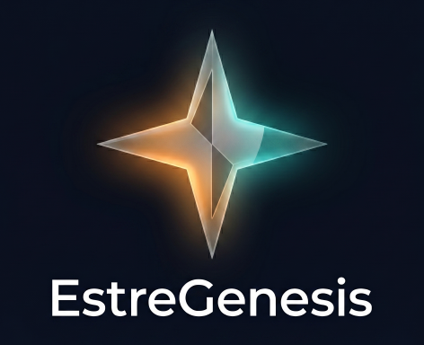

<p align="center">
  
</p>

<p align="center">
  
  <a href="LICENSE.md"></a>
  
  
  
</p>

<p align="center">
  
  
  
  
</p>

<a id="english"></a>

# EstreGenesis — AGENTS.md-First AI Native Seed System

**Language**: **English** (below) · [한국어](#korean)

> **Run Claude, Cursor, Copilot, Gemini, and other AI coding agents on the same codebase without rule-file chaos.** AGENTS.md-first seed prompts that bootstrap or migrate an AI-native project into a service-agnostic operating system for multi-agent collaboration.

Copy one file into your new project. Paste it as the first message to any AI coding agent. The agent runs an **interactive bootstrap** (new project) or a **structured migration** (existing project) that leaves you with a service-agnostic operating system for AI collaboration.

## Start in 60 seconds

1. Pick one seed: **Lite** ([English](AI_Native_Project_Seed_Prompt_Lite.md) / [한국어](AI_Native_프로젝트_시드_프롬프트_Lite.md)) is the default; use **Compact** ([English](AI_Native_Project_Seed_Prompt_Compact.md) / [한국어](AI_Native_프로젝트_시드_프롬프트_Compact.md)) if you already know the pattern, or **Master** ([English](AI_Native_Project_Master_Seed_Prompt.md) / [한국어](AI_Native_프로젝트_마스터_시드_프롬프트.md)) if you want every inline template.
2. Copy it into your target project as `.agent/seed_prompt.md`.
3. Paste the same file as the first message to Claude Code, Cursor, Copilot, Gemini, Codex, Cline, Windsurf, or another coding agent.

The agent will ask the Phase 0-7 bootstrap/migration questions and generate `AGENTS.md`, `.agent/`, and the bridge files you choose.

---

## Why this exists

Most AI coding guides tell you how to talk to **one** model. Real projects don't stay monogamous — you end up with a `CLAUDE.md` next to a `.cursor/rules/` next to a stray `GEMINI.md`, and the rules start to contradict each other. When two agents edit the same file at the same time, there's no coordination layer. When a blocker takes three hours to solve, the next session has no memory of the fix.

This seed bakes in patterns tested during the intensive operation of the author's second AI Native project, run with **three concurrent AI agents** (Antigravity + GitHub Copilot + Claude Code). The focus areas:

- **Preventing repeat mistakes** — `.agent/_lessons/` records every surprising blocker with tags; next session greps before touching the area.
- **Document-layer separation** — `.agent/` (agent workspace) vs `docs/` (developer runbooks) vs `executive-docs/` (strategy) vs `dashboard/` (user-action backlog) — each with a specific audience, no mixing.
- **Repo residency boundaries** — Phase 2.5 decides whether the workspace is the source repo, a private agent-docs sidecar, a multi-project orchestration repo, or an upstream/local split before choosing the `.agent/` shape.
- **Service-agnostic bridges** — `AGENTS.md` is the single source of truth. Every AI service's rule file (CLAUDE.md, GEMINI.md, .cursor/rules/, .windsurfrules, .aider.conf.yml, …) points to it or imports it where the tool supports imports. Switch services freely, rules don't break.
- **Concurrent multi-agent safety** — `.agent/_coordination/` with STATE.md, HANDOFF.md, CHANGELOG.md prevents file-edit collisions and gives every agent a live map of who's doing what.
- **Research-driven decisions** — Significant branch points (strategy, tech selection, legal, market) trigger a Research → Report → Plan → Link loop with URL-sourced evidence and honest "source unverified" markers.

---

## Why not just `CLAUDE.md`?

The seed starts paying for itself when any of these scenarios show up:

| Scenario | Single rules file (CLAUDE.md, .cursor/rules, …) | EstreGenesis pattern |
|---|---|---|
| 2nd or 3rd AI service joins the project | Duplicate rules per service file; they drift over time | Bridge files point each tool back to `AGENTS.md` — SSoT stays single |
| Two agents edit the same file at once | No coordination layer; last write wins | `_coordination/HANDOFF.md` claim ledger + live `STATE.md` map |
| 3-hour blocker solved last week | Stuck in chat history, gone next session | `_lessons/` entry, grepped at task start |
| Project already has scattered rule files | Manual triage, no template | Migration A: audit → extract `AGENTS.md` → rewrite bridges |
| Strategic decision (stack, legal, market) | Ad-hoc chat, no audit trail | Research → Report → Plan → Link loop with URL evidence |
| Seed-bootstrapped project, new seed version released | Manual diff and apply | Migration B: numbered delta menu, additive only |

If none apply, a single rules file is fine. If one applies, EstreGenesis starts paying for itself. If two or more apply, the bridge-and-SSoT pattern stops being optional.

---

## Beyond bootstrap — five optional modules

v1.x is the project seed — bootstrap a new AI-native project, or migrate an existing one, into the `AGENTS.md` SSoT (everything above). **v2.0+ adds five optional modules** layered on top:

- **[Constellation](Constellation.md)** (v2.0+) — live multi-agent orchestration. Graduates coordination from the file-based `.agent/_coordination/` ledger to a real-time live board (WebSocket + A2A messaging + dashboard). The **A2A bridge interface** is the invariant contract; reference runtime under [constellation/reference/](constellation/reference/) is Node deps-0 except `ws`. Components authored as `.eux` and brewed with **[EstreUX](https://github.com/SoliEstre/EstreUX)** — a separate Apache-2.0 runtime EG references (clone-and-run), not bundles or owns.

- **[Superscalar](Superscalar.md)** (v2.3+) — execution-scheduling discipline for parallel sub-agent dispatch. Five-dimension `issue_width` formula (effort_band + pace_mode + Little's Law + Kanban WIP + autonomy_available_workers) + cost-benefit-gated dispatch at the 30–60k token-horizon crossover + worktree-isolated reorder buffer + in-order retire + consistency gate + opt-in speculation. Production-ready (Stage 1 ships). n=8 dogfood ledger + Entry 06 controlled A/B showing "parallelism is not sufficient; orchestration discipline produces consistency."

- **[Hyperbrief](Hyperbrief.md)** (v2.3.20+) — decision-delegation gating discipline. Every user-facing decision question runs through a trigger rubric; if it escalates, the LLM emits a schema-enforced JSON IR and a deterministic Node renderer produces a 9-section Markdown brief + interactive HTML card. 4-axis × 5-level tone profile + skill-side auto-localize (button label + MD trigger phrases follow the user's prevailing conversation language). Cross-module integrations active: Constellation §13.16.9 (5 A2A intent names + ack_tier='decided') + Superscalar §3.1 (orthogonal gate at write/deploy/send lane retire). §11.5 v1.0 readiness rubric (Lens A 7-dim module-wide GA / Lens B 6-dim host-specific marketplace registration) shipped.

- **[Greatpractice](Greatpractice.md)** (v2.5.50+, v2.5.55 release-cadence ratified) — memory-triggered practice-codification discipline. Targets the &quot;quiet omission&quot; failure surface: small obligations that should accompany the work — &quot;update the docs alongside the code,&quot; &quot;check before sending,&quot; &quot;when X changes, also change Y&quot; — that usually start as memory notes and gradually slip through as those notes accumulate. Greatpractice treats agent-workspace memory feedback (`memory/feedback_*.md` or equivalent) as the input trigger and routes raw signals through a 5-axis multi-criteria maturation gate (frequency + depth + recency + cost + predictability weighted sum, threshold ≥ 18 OR 3-criterion notability) into a 3-tier macro/mezzo/micro hierarchy. Ratified entries are enforced via deterministic lifecycle hooks (SessionStart blocking / UserPromptSubmit path-scoped inject / PreToolUse 3-subtype poka-yoke contact/fixed-value/motion-step / PostToolUse SSoT propagation / Stop cycle-end probe / PostCompact working-set restore). Explicit `phronesis_boundary` field carves out judgement-heavy work that should NOT be codified. Backed by 9-axis cross-domain deep research (harness · humanities · psychology · management · processor · os · sre · memoization · canonical). v2.5.55 dual cut promotes the [`greatpractice/macro/release-cadence.md`](greatpractice/macro/release-cadence.md) entry from `_propose/draft` to ratified (user steering trigger at N=1 evidence; mezzo decomposition 8-candidate batch scheduled v2.5.56+).

- **[Ultrasafe](Ultrasafe.md)** (v2.5.55+) — pre-release / pre-update simulated penetration testing discipline. Targets the &quot;ship-then-discover&quot; failure surface: security problems found by external users after release rather than by internal verification before. Ultrasafe ships every release through a Superscalar-applied Workflow where 8 parallel red-team agents (v0.1.0 minimum fan-out — AI/LLM · Web/API · Supply · Crypto · Social · Method/Comp · TM/Lifecycle · Synthesizer + GTA/DSP cross-cutting) simulated-attack from independent perspectives, emit findings via the Finding Output Contract (§4 of the spec), aggregate at the Synthesizer with BFT 2f+1 quorum + cross-axis correlation, and produce a 3-layer report (OSCAL Assessment Result + Hyperbrief 9-section IR + Greatpractice tree candidate). The ≥3 iteration loop runs until 4-condition AND clean signal: regression-free + monotonic improvement + coverage gate + 2 iter consecutive with agent diversity invariant. Dual pre-release trigger (PreToolUse hook on `git push --tags` / `npm publish` / `gh release` / etc. 7 matchers + `/ultrasafe` skill). 5 new Constellation A2A intents (`ULTRASAFE_FINDING` / `ITERATION_BOUNDARY` / `RELEASE_GATE` / `SECURITY_DISCLOSURE_INTAKE` / `MPCVD_COORDINATION`). **Advisory-only v0.1.x → blocking v0.2.x** staged transition (Tier 3 release strict / Tier 1/2 opt-in). Backed by 17-axis cross-domain deep research (harness · web · AI · threat-modeling · multi-agent · adversarial-ml · fuzzing · supply-chain · devsecops · IR · crypto · human-factors · game-theory · compliance · cognitive · visualization · protocol-trust-evolution). v0.1.0 first cut ships the full spec (2544 lines, §1-§13 + appendix A-C) + plugin manifest; runtime (attack agent dispatch / iteration loop runner / 3-layer report generator / 5 A2A intent handlers / PreToolUse hooks / MCP server) deferred to v0.2+ roadmap.

All five modules are **optional** and **referenced** (not bundled into the seed tiers, so the tier seeds stay lean). File-based coordination (Phase 5) remains the default and is enough for most projects.

### Install as Claude Code plugins (self-hosted marketplace)

The same five modules also ship as Claude Code plugins via a **self-hosted marketplace** in this repo. From any Claude Code session:

```
/plugin marketplace add SoliEstre/EstreGenesis
/plugin install constellation@estregenesis-plugins
/plugin install superscalar@estregenesis-plugins
/plugin install hyperbrief@estregenesis-plugins
/plugin install greatpractice@estregenesis-plugins
/plugin install ultrasafe@estregenesis-plugins
```

Each plugin is independent — install one, two, three, or all four. The marketplace metadata lives at [.claude-plugin/marketplace.json](.claude-plugin/marketplace.json); each plugin's source is under [plugins/](plugins/). Apache-2.0. The plugins are Phase 2 production-ready (Constellation v0.2.3 + MCP server with 5 tools; Superscalar v0.1.2 + §3.1 Hyperbrief interlock; Hyperbrief v0.5.6 + 3 skills + MCP server with 4 tools + PreToolUse/Stop hooks; Greatpractice v0.1.0 + 3 JSON schemas + 1 PreToolUse contact hook). Anthropic-side community-marketplace listing is deferred to v1.0 GA per [Hyperbrief.md §11.5](Hyperbrief.md) readiness rubric Lens B.

---

## Three tiers — pick one per project

| Tier | Size | Primary use | Target reader |
|---|---|---|---|
| **Master** | ~2425 lines | New projects that need deep guidance, teams learning the pattern for the first time, edge cases where you need every inline template (full AGENTS.md + `.gitignore` per-stack rows + escape/HTML/PDF scripts + bridge templates) | First-time AI Native author; teams formalizing a process |
| **Lite** | ~1105 lines | Quick new projects, migration sessions, onboarding new AI services into existing projects, when the master would eat too much context window. Self-contained — embeds inline templates for AGENTS.md, `.agent/rules.md`, `.gitignore`, scripts, and bridge stubs in compressed form | Returning author who remembers the pattern; most projects |
| **Compact** | ~130 lines | Authors who already know the pattern and want the minimum viable seed; tightest context window; bullet triggers + algorithm-spec descriptions only (the agent generates the actual files following the specs) | Power user who just needs a checklist |

You place **one tier** into your project. Not all three. Cross-referencing tiers that aren't present produces dead links and agent confusion, so each tier is **self-contained** — internally complete, no forward or backward references to other tiers.

When a project grows to need more detail, you don't upgrade tiers in-place. You simply replace the file with the next tier and commit. Agents treat it as a normal doc update.

---

## File list

```
AI_Native_Project_Master_Seed_Prompt.md       ← English master (deepest, ~2425 lines)
AI_Native_Project_Seed_Prompt_Lite.md         ← English lite (~1105 lines, self-contained)
AI_Native_Project_Seed_Prompt_Compact.md      ← English compact (~130 lines, self-contained)
AI_Native_프로젝트_마스터_시드_프롬프트.md       ← Korean master
AI_Native_프로젝트_시드_프롬프트_Lite.md          ← Korean lite
AI_Native_프로젝트_시드_프롬프트_Compact.md       ← Korean compact
Constellation.md                               ← v2.0+ module: live multi-agent orchestration guide (WS + A2A)
constellation/                                 ← v2.0+ module: .eux specs + reference runtime (server / bridge / watcher / watchdog / dashboard)
Superscalar.md                                 ← v2.3+ module: parallel sub-agent execution-scheduling discipline
Hyperbrief.md                                  ← v2.3.20+ module: decision-delegation gating discipline (JSON IR + deterministic renderer)
plugins/                                       ← Claude Code plugins (constellation / superscalar / hyperbrief) for the self-hosted marketplace
.claude-plugin/marketplace.json                ← Self-hosted Claude plugin marketplace metadata (estregenesis-plugins)
README.md                                      ← This file (library index; don't ship to projects)
LICENSE.md                                     ← Apache License 2.0 text
logo/EstreGenesis.png                          ← README logo
```

Each language pair (English + Korean) of a given tier is fully aligned — same phases, same migration logic, same operational guidance. Pair them if your team is bilingual. **v2.0+** adds three optional referenced modules (Constellation + Superscalar + Hyperbrief), each also shipped as a Claude Code plugin via the self-hosted marketplace — see the changelog.

---

## Migration scenarios

For a new project, see [Start in 60 seconds](#start-in-60-seconds) above. To migrate an existing project, pick the path below — see [§ Migration details](#migration-details-the-unique-contribution) for red flags and edge cases per scenario.

### Migration A — existing project, no formal AI collaboration setup

1. Copy the **Lite** file into the project (Lite has the best migration prose).
2. Paste as first message.
3. Tell the agent: *"This project already exists — please audit first and propose migration."*
4. Agent enters **Migration A** mode: audits every `CLAUDE.md` / `.cursor/rules/` / scattered agent notes, presents inventory, proposes extraction of service-agnostic rules into a new `AGENTS.md` SSoT.
5. Review the extraction, approve, let the agent point bridge files back to `AGENTS.md`, reorganize `.agent/`, and record the migration in `.agent/_lessons/001_AI_Native_Migration.md`.

### Migration B — existing project, already seed-bootstrapped with an older version

1. Copy the current-version seed into the project (same tier as the previous one — don't tier-upgrade during a version migration).
2. Paste as first message.
3. Tell the agent: *"Project was bootstrapped with an earlier version of this seed — please upgrade additively."*
4. Agent enters **Migration B** mode: identifies starting version, diffs capabilities (missing research loop? missing multi-agent coordination? missing migration guides themselves?), presents numbered delta menu.
5. Review, approve selected deltas, agent applies additively — never rewriting existing user customizations.

### Migration C — hybrid

Parts of the project are seed-compliant, parts are ad-hoc. Agent runs **Migration C**: subsystem-by-subsystem, applying A or B as appropriate, documenting the hybrid origin.

---

## What the seed produces

After Phase 7 (bootstrap) or a migration completes, the default source-repo shape is:

```
your-project/
├── AGENTS.md                          ← single source of truth for all AI services
├── .agent/
│   ├── seed_prompt.md                 ← the seed file you placed (so agents can re-read)
│   ├── rules.md                       ← detailed work rules
│   ├── architecture.md                ← tech stack, data flow, dependencies
│   ├── _coordination/                 ← multi-agent workspace (if applicable)
│   │   ├── STATE.md                   ← live "who's doing what"
│   │   ├── HANDOFF.md                 ← file-claim ledger
│   │   └── CHANGELOG.md               ← completion log
│   ├── _contracts/                    ← API/Event/Type contracts between parts
│   ├── _questions/                    ← async cross-agent Q&A
│   │   ├── open/
│   │   └── resolved/
│   ├── _lessons/                      ← troubleshooting memory
│   └── PM/                            ← plans, 3-digit prefix
│       └── 001_Phase1_Plan.md
├── CLAUDE.md                          ← Claude Code bridge (points to AGENTS.md)
├── GEMINI.md                          ← Gemini bridge
├── .github/copilot-instructions.md    ← Copilot bridge
├── .cursor/rules/main.mdc             ← Cursor bridge
├── (other bridges based on your Phase 4 choices)
├── docs/                              ← developer runbooks (optional)
├── executive-docs/                    ← strategy, legal (optional, larger projects)
├── dashboard/                         ← user-action backlog (optional)
└── meetings/                          ← meeting records (optional)
```

Phase 2.5 may choose a non-default `<scope-root>` first: direct `.agent/` for ordinary source repos, `.agent/<unit-project-name>/` for multi-project orchestration, or `<scope-root>/project/` plus `<scope-root>/upstream/` for upstream-bound work. Sidecar setups add source-map/public-boundary docs and only add a source folder to `.gitignore` after the user identifies it and the agent verifies it exists in the workspace.

Every AI service that joins the project later reads `AGENTS.md` and is immediately productive. No service-specific onboarding, no "wait, what are the rules here?" — everything lives in one place.

---

## The operating loop (after bootstrap)

Every agent — the one you use daily, and any new one joining — follows this 8-step loop:

The list below uses default `.agent/` paths; replace them with `<scope-root>` when Phase 2.5 selected a non-default residency shape.

1. Read `AGENTS.md` (SSoT)
2. Read `.agent/rules.md` + `.agent/architecture.md`
3. Read `.agent/_coordination/STATE.md` (multi-agent projects only)
4. Grep `.agent/_lessons/` for tags related to the current task
5. Claim shared files in `.agent/_coordination/HANDOFF.md` before editing
6. Record blockers in `.agent/_questions/open/`
7. Log completion in `.agent/_coordination/CHANGELOG.md`, remove from STATE.md
8. Record surprises (>30 min investigations) in `.agent/_lessons/`

This is the OS of an AI-native project. Steps 4, 7, 8 are the memory. Steps 3, 5, 6 are the coordination. Steps 1, 2 are the constitution.

---

## Supported AI services (bridges scaffolded out of the box)

| Service | Bridge file |
|---|---|
| Claude Code | `CLAUDE.md` + `.claude/rules/` |
| Google Antigravity / Gemini CLI | `GEMINI.md` |
| GitHub Copilot (VS Code agent) | `.github/copilot-instructions.md` |
| Cursor | `.cursor/rules/main.mdc` |
| Windsurf | `.windsurfrules` |
| Aider | `.aider.conf.yml` + read list |
| Continue.dev | `.continue/config.yaml` |
| Cline | `.clinerules/main.md` |
| Amazon Q Developer | `.amazonq/rules/main.md` |
| Zed / generic | `.rules` |
| OpenAI Codex CLI / Jules / Kiro / others | Read `AGENTS.md` directly |

Every bridge points the service back to `AGENTS.md` (or imports it where supported) plus whatever service-specific knobs that tool requires. Switching services is a no-op — the SSoT stays.

When a new AI service launches, you just add one more bridge file. The rule system doesn't have to change.

---

## Migration details (the unique contribution)

Bootstrap is useful. Migration is where this seed earns its keep. Three scenarios covered in every tier:

### Migration A — scattered AI files → `AGENTS.md` standard

Your project already has `CLAUDE.md` with 143 lines of rules, a `.cursor/rules/` with 89 lines, some `.agent/notes/decisions.md` that never got organized, and no single source of truth. The agent audits the inventory first (never scaffolds blind), extracts service-agnostic rules into a fresh `AGENTS.md`, rewrites each existing bridge file to import from it, reorganizes `.agent/` into the standard shape, and records what moved where in `.agent/_lessons/001_AI_Native_Migration.md`. Red flags — conflicting rules across bridges, prior git history in `.agent/`, custom coordination schemes the user prefers to keep — stop the agent and require explicit user decision before proceeding.

### Migration B — previous seed version → current

Project was bootstrapped with an older version of this seed (missing the research loop, multi-agent coordination layer, migration guides, or Bootstrap Residency checks). The agent identifies the starting version, diffs capabilities, presents a numbered menu of available deltas. The user picks which to apply. Every addition is marked with `<!-- added in seed vX.Y migration, YYYY-MM-DD -->` so future readers can trace lineage. **Existing user customizations are preserved** — the agent never re-runs the Phase 0-7 interview on a migrated project.

### Migration C — hybrid

Parts of the project are seed-compliant, parts are ad-hoc custom structure. The agent runs A on the custom parts, B on the seed-compliant parts, merges results in `AGENTS.md`, and documents the hybrid origin. Hybrid migrations often surface real business logic that a pure A or B would miss — the seed treats this as a high-value lessons-file opportunity, not a nuisance.

---

## Design principles

The seed reflects six opinions earned the hard way:

1. **Docs before code, not the other way around.** Every decision lives in a file. An agent that can't find the decision will reinvent (often differently from last time).
2. **One SSoT (`AGENTS.md`), many bridges.** Service proliferation is a given. Centralize shared rules, let each service keep its own knobs.
3. **Memory compounds through `_lessons/`.** A 30-minute debug session becomes a 30-second grep next time.
4. **Coordination is explicit, not implicit.** Multi-agent projects need STATE/HANDOFF/CHANGELOG. "Just trust each other not to collide" does not scale past two agents.
5. **Research-driven decisions for branch points.** Ad-hoc strategic decisions are how projects compound tech debt silently. Research → Report → Plan → Link turns every major choice into an auditable trail.
6. **Repo residency before doc shape.** Public/collab source repos, private agent-docs repos, multi-project orchestration, and upstream-bound work need different `<scope-root>` decisions before files are created.

---

## Versioning

Each tier has its own version. Master is the authoritative evolution track; Lite and Compact are derived regularly from Master but may lag by a release.

**Current**: v2.5.94 (2026-06-13) — **Superscalar v0.5.0 — topology pattern catalog (§1.5, divergence / reconvergence vocabulary)** — the C2 absorption from the netwaif/multi-agent-starter benchmark, adjusted EG-native (concept/vocabulary only, no code copy — north-star axis 2). A new §1.5 names the two SIMT-lineage primitive verbs — **divergence** (work splits into concurrent lanes; richer than plain fan-out, spanning homogeneous *and* heterogeneous splits) and **reconvergence** (the lanes merge back) — plus three reconvergence *modes* (**synthesis** = combine into a new whole / the existing synthesis barrier; **retire** = in-order commit / the existing §3 retire; **review** = one lane gates another). The starter's four patterns (Pipeline / Fan-out·Fan-in / Expert Pool / Producer-Reviewer) are then *recognized*, not added, as the divergence→reconvergence shapes the existing issue_width / lane-class / retire / Hyperbrief-interlock machinery already expresses, each pinned to its mechanism so an operator can request a shape by name. Speculation (§4) is reframed as *speculative divergence* that may be squashed before reconvergence; the Constellation board (§6) projects the divergence→reconvergence shape. starter attribution (MIT) per the EstreUX external-framework rule. Surfaces: Superscalar.md frontmatter + docs/superscalar.html (hero + meta) + docs/index.html module-tag, all v0.4.3 → v0.5.0. **No wire change**. verify-nway 10-axis PASS.

Previously: v2.5.93 (2026-06-13) — **Constellation v2.4.23 — PreCompact hook schema fix** — the compact-survival pipeline's `pre-compact-snapshot.cjs` (shipped v2.4.14) emitted `hookSpecificOutput:{hookEventName:'PreCompact', additionalContext:…}`, which fails the host hook-output schema on every compaction — the schema reserves `additionalContext` for UserPromptSubmit/PostToolUse/Stop-family events and PreCompact has no such channel, so the environment snapshot silently went stale. Post-compaction re-injection is already owned by the SessionStart(matcher:"compact") hook that re-reads the whole handoff file, so the PreCompact half only needs to write the snapshot: it now writes the file and exits with a schema-valid `{suppressOutput:true}` (confirmation routed to stderr). Both the shipped reference (`constellation/reference/runtime/pre-compact/`) and this workspace's active hook fixed. Caught live when a manual `/compact` surfaced the validation error. **No wire change**. verify-nway 10-axis PASS.

Previously: v2.5.92 (2026-06-13) — **Constellation v2.4.22 — dashboard dead-code prune (setupWsCollab removed)** — a `/roundnext` round's small-ripe pickup. `setupWsCollab` (50 lines) had been unwired since the v2.4.2 key-issuance unification folded its 🔗 button into `setupWsKeyMgmt`; the E2b rough-tier verification (146-symbol sweep) confirmed it as genuine dead code (defined, never invoked — the only "call site" was the removal comment itself). Removed from the reference dashboard with a one-line tombstone comment; the `ws-collab-invite.eux` provenance note updated from "is dead code" to "removed @ v2.4.22". Round companions (no version surface): the tracked done-`id` standardization question closed by verification — `state-schema.md §2` already lists `id` as optional for `done` entries, so the worker's original "non-canonical field" caution was over-strict and no schema change is needed; two planned items re-classified to honest blocked form (Ultrasafe evidence is gated on the self-dogfood decision; the multigroup schema expansion is gated on the recorded "enter on limit signals" decision); the two hub-side blockers escalated to §13.20 tier 2 (explicit reminder + ETA query, findings attached). **No wire change**. verify-nway 10-axis PASS.

Previously: v2.5.91 (2026-06-13) — **Hyperbrief v0.7.0 — post-response tone-estimate Stop hook (deferred candidate #5 landed)** — track ③, the last of the three user-approved feedback tracks. The v0.6 triage deferred #5 ("hook post-response tone evaluation layer") on "needs a PostResponse hook spec to stabilize"; a blocker drill proved the host's **Stop hook is the PostResponse equivalent** (officially documented lifecycle + block capability + battle-tested in this workspace every turn), and the triage's "hooks are only PreToolUse+Stop" premise was itself stale. Landed as an extension of the existing §11.4 hook tier — not a new architectural layer: **(1) `hooks/tone-estimate.cjs`** (Stop, advise mode, exit 0 always) — armed only while `.hyperbrief/active-profile.json` exists; extracts the last assistant text from the transcript and re-runs the renderer's deterministic 6-heuristic `estimateSurfaceProfile` (now re-exported from mini-engine, additive) against the declared profile; |Δ| ≥ 2 on any axis (renderer-consistent threshold) emits ONE advisory suggesting the §5.6.7 fallback re-render; repeat advisories suppressed per decision_id + gap signature (§2.4 alert-fatigue), 24h TTL backstop. **(2) Skill MUST-20** — at IR-emit time the skill also writes the active-profile file (decision_id + declared tone), arming the hook; deleting it closes the cycle. **(3) Spec**: §5.6.7-pre gains the post-response tier paragraph; §11.4 hook contract gains the tone line. End-to-end verified: gap-advise fires (declared L1.1.1 vs technical-register text → audience L1→L5 flagged), repeat run silent, unarmed run silent. Zero cost on every non-brief turn. **No wire change**. verify-nway 10-axis PASS (docs-badge axis also expanded this session to all 5 modules — caught and fixed 2 more stale hero badges).

Previously: v2.5.90 (2026-06-13) — **Greatpractice v0.3.1 — micro-tier first decomposition (mezzo 9 → 20 atoms)** — the user-approved track ② cut. Every mezzo entry now carries its executable atoms: two per mezzo (three for `n-way-sync-registry`), each a command-check-decision 3-tuple per the canonical `outbox-append-json-roundtrip` pattern — e.g. `version-bump-all-surfaces`, `dry-run-file-list-review`, `internal-name-grep-zero`, `tty-publish-check`, `outbox-write-route-gate` (a PreToolUse route gate for the outbox-push discipline). Built by a 10-agent workflow with the anti-padding rule ("if the mezzo yields one good atom, write one") — three agents correctly returned "no new atom" where the parent mezzo's own enumeration was already satisfied, and the run rode the §3.2 resume cache through a mid-flight session-budget wall (7 cached + 2 live on re-issue, zero duplicate cost — the discipline's second live validation). Verification (real YAML parser + `node --check` on 33 extracted JS blocks) caught 2 frontmatter parse failures (unquoted scalars containing `: `) — fixed across all 10 affected files in one sweep, re-verified 20/20 PASS. INDEX.md gains the micro section in count+discovery form (atom ids live on disk; the ≤300-token cap remains a v0.2+ auto-gen target, unchanged-class placeholder). Known follow-ups recorded: `.greatpractice/blocklist` SSoT is adopter-local (atoms self-guard on absence); two Decision blocks carry illustrative cross-invocation state. **No wire change**. verify-nway 10-axis PASS.

Earlier releases: every entry is preserved in [CHANGELOG.md](CHANGELOG.md) — this list keeps only the most recent few.

**Full changelog** (all releases from v1.0 onward, EN + KO): [CHANGELOG.md](CHANGELOG.md).

This upstream repository's `CHANGELOG.md` is the changelog SSoT. Each seed file keeps only a compact header metadata line with tier, language, current version, counterpart, and a pointer back to that `CHANGELOG.md`, not the target project's README. When you upgrade a project using Migration B, the agent uses the seed header version marker plus the changelog to compute the delta.


---

## Contributing

The seed is a living artifact. If you run it on a project and find:

- A **question the bootstrap interview should be asking** but doesn't → extend the relevant Phase.
- An **unnecessary question** that always gets "skip" → remove it.
- A **new AI service** that doesn't have a bridge template → add to Phase 4 + bridge templates.
- A **battle-tested multi-agent tip** not yet captured → extend the Multi-Agent Coordination Tips section (Master tier).
- A **counter-example of the research-driven decision loop** → extend the anti-patterns / self-audit checklist.
- A **new migration edge case** → extend § Migration Guides with a new scenario or red flag.

Changes to Master trickle to Lite and Compact as distillation. Only the Master should be edited for substantive content; Lite and Compact are tightened views of the same material.

---

## License

Copyright 2026 SoliEstre (Estre Soliette).

The seed prompts are licensed under the **Apache License 2.0**. You may copy, modify, and redistribute them under the terms in [LICENSE.md](LICENSE.md). The patterns encoded (document layer separation, SSoT via `AGENTS.md`, `.agent/_lessons/` memory loop, migration A/B/C scenarios) are intended as an **open standard** — adapt them to your stack, contribute improvements back.

The specific bridge-file format for each AI service follows each service's own convention. This seed does not claim any authority over the individual bridge formats — only over the unified pattern that makes them interoperate.

---

## Credits

Patterns distilled from running the author's second AI Native project through intensive multi-agent operation (Antigravity, Claude Code, GitHub Copilot). Every `_lessons/` entry in the seed descends from a real blocker that cost real time. Every migration red flag came from a real mistake.

If this seed saves you from making the same mistakes, great. If it helps you make *different* mistakes and contribute *new* lessons back, even better.

---

## Related reading

- **AGENTS.md standard** — convergence pattern for AI coding agents across Claude, Codex CLI, Jules, Kiro, and others. See `https://agents.md` if/when a community-maintained spec emerges; meanwhile every tier in this seed implements the pattern.
- **Model Context Protocol (MCP)** — Anthropic's open standard for AI tool integration. Relevant when your project wants AI agents to act *on* it (not just edit the code of it). Out of scope for the seed itself.
- **Claude Agent Skills** — Anthropic's skill packaging format. A seed-bootstrapped project can optionally ship a `skills/<project>/SKILL.md` for direct Claude integration.

These are ecosystem touchpoints, not seed prerequisites. The seed works independently of any of them.

---

<a id="korean"></a>

# EstreGenesis — AGENTS.md 우선 AI Native 시드 시스템 (한국어)

**언어**: [English](#english) · **한국어** (아래)

> **Claude·Cursor·Copilot·Gemini 등 여러 AI 코딩 에이전트를 같은 코드베이스에서 룰 파일 카오스 없이 운용.** AGENTS.md 우선 시드 프롬프트가 신규 AI Native 프로젝트를 부트스트랩하거나 기존 프로젝트를 마이그레이션해, 멀티에이전트 협업을 위한 서비스 중립 운영 체제로 만듭니다.

파일 하나를 새 프로젝트에 복사. AI 코딩 에이전트의 첫 메시지로 붙여넣기. 에이전트가 **대화형 부트스트랩**(신규 프로젝트) 또는 **체계적 마이그레이션**(기존 프로젝트)을 실행해, AI 협업을 위한 **서비스 중립 운영 체제**를 프로젝트에 남깁니다.

## 60초 시작

1. 시드 하나 선택: **Lite** ([English](AI_Native_Project_Seed_Prompt_Lite.md) / [한국어](AI_Native_프로젝트_시드_프롬프트_Lite.md))가 기본값. 패턴을 이미 알면 **Compact** ([English](AI_Native_Project_Seed_Prompt_Compact.md) / [한국어](AI_Native_프로젝트_시드_프롬프트_Compact.md)), 모든 인라인 템플릿이 필요하면 **Master** ([English](AI_Native_Project_Master_Seed_Prompt.md) / [한국어](AI_Native_프로젝트_마스터_시드_프롬프트.md))를 사용.
2. 대상 프로젝트에 `.agent/seed_prompt.md`로 복사.
3. 같은 파일을 Claude Code, Cursor, Copilot, Gemini, Codex, Cline, Windsurf 등 AI 코딩 에이전트의 첫 메시지로 붙여넣기.

에이전트가 Phase 0-7 부트스트랩/마이그레이션 질문을 진행하고 `AGENTS.md`, `.agent/`, 선택한 브릿지 파일을 생성합니다.

## 왜 존재하는가

대부분의 AI 코딩 가이드는 **하나**의 모델과 대화하는 법을 알려줍니다. 실제 프로젝트는 일부일처를 유지하지 못합니다 — `CLAUDE.md` 옆에 `.cursor/rules/`, 그 옆에 방치된 `GEMINI.md` 가 쌓이고, 규칙들이 서로 모순되기 시작합니다. 두 에이전트가 동시에 같은 파일을 편집할 때 코디네이션 레이어는 없습니다. 3시간 걸려 해결한 블로커는 다음 세션에서 기억되지 않습니다.

본 시드는 **3개 AI 에이전트 동시 운용**(Antigravity + GitHub Copilot + Claude Code)으로 돌린 Author의 두 번째 AI Native 프로젝트의 집중 운영 경험에서 추려낸 패턴을 내재화합니다. 초점:

- **같은 실수 반복 방지** — `.agent/_lessons/` 가 모든 예상 밖 블로커를 태그와 함께 기록; 다음 세션은 해당 영역 건드리기 전 grep.
- **문서 레이어 분리** — `.agent/`(에이전트 워크스페이스) vs `docs/`(개발자 런북) vs `executive-docs/`(전략) vs `dashboard/`(사용자 조치 백로그) — 각각 특정 독자, 섞이지 않음.
- **repo residency 경계** — Phase 2.5 가 작업공간이 소스 repo, 개인 개발/에이전트 문서 sidecar, 다중 프로젝트 오케스트레이션 repo, upstream/local split 중 무엇인지 먼저 정한 뒤 `.agent/` 모양을 선택.
- **서비스 중립 브릿지** — `AGENTS.md` 가 단일 SSoT. 모든 AI 서비스의 규칙 파일(CLAUDE.md, GEMINI.md, .cursor/rules/, .windsurfrules, .aider.conf.yml, …)이 이를 가리키거나, 도구가 지원하면 import. 서비스 자유롭게 전환해도 규칙 불변.
- **동시 멀티에이전트 안전성** — `.agent/_coordination/` 의 STATE.md·HANDOFF.md·CHANGELOG.md 가 파일 편집 충돌 예방 + 모든 에이전트에게 실시간 작업 맵 제공.
- **리서치 기반 의사결정** — 중대 분기점(전략·기술·법무·시장)에서 Research → Report → Plan → Link 루프가 발동, URL 출처와 "출처 미확인" 정직 마커를 동반.

## 그냥 `CLAUDE.md` 쓰면 안 되나?

다음 중 하나라도 해당되면 시드가 제값을 하기 시작:

| 시나리오 | 단일 룰 파일 (CLAUDE.md, .cursor/rules, …) | EstreGenesis 패턴 |
|---|---|---|
| 2번째·3번째 AI 서비스 합류 | 파일별 룰 복제, 시간이 지나며 drift | 각 브릿지 파일이 `AGENTS.md` 를 가리킴 — SSoT 단일 유지 |
| 두 에이전트가 동시에 같은 파일 편집 | 코디네이션 레이어 없음, last write wins | `_coordination/HANDOFF.md` claim 원장 + 실시간 `STATE.md` |
| 지난주 3시간 디버그한 블로커 | 채팅 기록에 매몰, 다음 세션엔 사라짐 | `_lessons/` 항목, 다음 세션 시작 전 grep |
| 프로젝트에 이미 산발적 룰 파일들 | 수동 정리, 템플릿 없음 | 마이그레이션 A: 감사 → `AGENTS.md` 추출 → 브릿지 재작성 |
| 전략·기술·법무 결정 | 즉흥 채팅, 감사 가능한 trail 없음 | Research → Report → Plan → Link 루프, URL 출처 동반 |
| 시드 부트스트랩된 프로젝트, 신버전 출시 | 수동 diff + 적용 | 마이그레이션 B: 번호 delta 메뉴, 가산적 적용 |

해당사항 없으면 단일 룰 파일로 충분. 하나라도 해당하면 EstreGenesis가 제값을 하기 시작하고, 둘 이상이면 브릿지 + SSoT 패턴은 더 이상 옵션이 아님.

## bootstrap 너머 — 3 선택 모듈

v1.x 는 프로젝트 시드 — 신규 AI-Native 프로젝트 부트스트랩, 또는 기존 프로젝트를 `AGENTS.md` SSoT 로 마이그레이션 (위의 모든 내용). **v2.0+ 는 그 위에 5개의 선택 모듈 추가**:

- **[Constellation](Constellation.md)** (v2.0+) — 실시간 멀티에이전트 오케스트레이션. 파일 기반 `.agent/_coordination/` 코디네이션을 실시간 라이브보드 (WebSocket + A2A 메시징 + 대시보드) 로 격상. **A2A 브릿지 인터페이스**가 불변 계약. [constellation/reference/](constellation/reference/) 의 참조 런타임은 Node deps-0 (`ws` 제외). 컴포넌트는 `.eux` 로 작성하여 **[EstreUX](https://github.com/SoliEstre/EstreUX)** (별도 Apache-2.0 런타임, EG 가 *참조* — clone-and-run, 번들·소유 안 함) 로 brew.

- **[Superscalar](Superscalar.md)** (v2.3+) — 병렬 서브에이전트 dispatch 의 실행 스케줄링 규율. 5차원 `issue_width` 공식 (effort_band + pace_mode + Little's Law + Kanban WIP + autonomy_available_workers) + 30-60k 토큰 horizon 교차점에서의 cost-benefit gated dispatch + worktree-isolated reorder buffer + in-order retire + consistency gate + opt-in speculation. Production-ready (Stage 1 ship). n=8 dogfood ledger + Entry 06 controlled A/B 가 "병렬화만으로는 불충분; 오케스트레이션 규율이 일관성을 만든다" 입증.

- **[Hyperbrief](Hyperbrief.md)** (v2.3.20+) — 결정 위임 게이팅 규율. 모든 user-facing 결정 질문이 트리거 rubric 통과, 에스컬레이션 시 LLM 이 schema 강제 JSON IR emit, 결정론적 Node renderer 가 9-section Markdown 브리핑 + interactive HTML 카드 산출. 4축 × 5단계 톤 프로파일 + skill-side auto-localize (버튼 라벨 + MD trigger phrase 가 사용자의 prevailing 대화 언어 따라감). Cross-module 통합 active: Constellation §13.16.9 (5 A2A intent name + ack_tier='decided') + Superscalar §3.1 (write/deploy/send lane retire 시 orthogonal gate). §11.5 v1.0 readiness rubric (Lens A 7-차원 모듈 전체 GA / Lens B 6-차원 host-specific 마켓플레이스 등록) ship 완료.

- **[Greatpractice](Greatpractice.md)** (v2.5.50+, v2.5.55 release-cadence 정식 등록) — 메모리 기반 관행 codification 규율. AI 와 함께 작업하면서 자연스럽게 형성되지만 점점 누락되는 자잘한 약속들 — 「코드 수정 시 docs 도」, 「보내기 전 확인」, 「X 가 바뀌면 Y 도」 — 의 *조용한 누락* failure surface 를 target. 보통 메모리 메모로 시작했다가 메모가 누적될수록 점점 안 읽히고 누락이 늘어나는 패턴이에요. Greatpractice 는 agent-workspace 메모리 feedback (`memory/feedback_*.md` 또는 동등 surface) 을 입력 트리거로 받고, raw 신호를 5-axis multi-criteria maturation gate (frequency + depth + recency + cost + predictability weighted sum threshold ≥ 18 OR 3-criterion notability) 를 통해 3-tier macro/mezzo/micro 계층으로 route. ratified entry 는 deterministic lifecycle hook (SessionStart blocking / UserPromptSubmit path-scoped inject / PreToolUse 3-subtype poka-yoke contact/fixed-value/motion-step / PostToolUse SSoT propagation / Stop cycle-end probe / PostCompact working-set 복구) 으로 강제. 명시적 `phronesis_boundary` field 가 judgement-heavy work 의 codify-금지 영역 명시. 9축 cross-domain 딥리서치 (harness · humanities · psychology · management · processor · os · sre · memoization · canonical) 가 backing. v2.5.55 dual cut 이 [`greatpractice/macro/release-cadence.md`](greatpractice/macro/release-cadence.md) entry 를 `_propose/draft` 에서 ratified 로 promote (user steering trigger at N=1 evidence; mezzo decomposition 8-candidate batch v2.5.56+ 예정).

- **[Ultrasafe](Ultrasafe.md)** (v2.5.55+) — 출시 직전 / 갱신 직전 모의 침투 시험 규율. *출시 후 발견* failure surface 를 target: 보안 문제가 외부 사용자에 의해 발견되는 시점이 출시 후이지, 내부 검증으로 출시 전이 아닌 패턴. Ultrasafe 는 매 release 를 Superscalar-applied Workflow 로 ship, 8 병렬 공격 에이전트 (v0.1.0 최소 fan-out — AI/LLM · Web/API · Supply · Crypto · Social · Method/Comp · TM/Lifecycle · Synthesizer + GTA/DSP cross-cutting) 가 독립 관점에서 모의 공격, Finding Output Contract (§4) 로 발견 emit, Synthesizer 에서 BFT 2f+1 quorum + cross-axis correlation 으로 합성, 3-layer 보고서 (OSCAL Assessment Result + Hyperbrief 9-section IR + Greatpractice tree candidate) 산출. ≥3 iteration loop 가 4-condition AND clean signal 까지 실행: regression-free + monotonic improvement + coverage gate + 2 iter consecutive + agent diversity invariant. Dual pre-release trigger (PreToolUse hook on `git push --tags` / `npm publish` / `gh release` / 등 7 matcher + `/ultrasafe` skill). 5 신규 Constellation A2A intent. **Advisory-only v0.1.x → blocking v0.2.x** 단계 전환 (Tier 3 release strict / Tier 1/2 opt-in). 17축 cross-domain 딥리서치 backing. v0.1.0 첫 cut ship = 전체 사양 (2544 줄, §1-§13 + 부록 A-C) + plugin manifest; runtime (공격 에이전트 dispatch / iteration loop runner / 3-layer 보고서 generator / 5 A2A intent handler / PreToolUse hook / MCP server) v0.2+ deferred.

다섯 모듈 모두 **선택적** + **참조** (시드 티어 본문에 번들되지 않으므로 시드는 lean 유지). 파일 기반 코디네이션 (Phase 5) 이 기본이며 대부분 프로젝트에 충분.

### Claude Code 플러그인으로 설치 (repo 자체 마켓플레이스)

다섯 모듈은 본 repo 의 **repo 자체 마켓플레이스** 를 통해 Claude Code 플러그인으로도 ship. Claude Code 세션에서:

```
/plugin marketplace add SoliEstre/EstreGenesis
/plugin install constellation@estregenesis-plugins
/plugin install superscalar@estregenesis-plugins
/plugin install hyperbrief@estregenesis-plugins
/plugin install greatpractice@estregenesis-plugins
/plugin install ultrasafe@estregenesis-plugins
```

각 플러그인 독립 — 하나, 둘, 셋, 또는 넷 모두 설치 가능. 마켓플레이스 메타데이터는 [.claude-plugin/marketplace.json](.claude-plugin/marketplace.json), 각 플러그인 소스는 [plugins/](plugins/) 아래. Apache-2.0. Phase 2 production-ready (Constellation v0.2.3 + 5-tool MCP 서버; Superscalar v0.1.2 + §3.1 Hyperbrief interlock; Hyperbrief v0.5.6 + 3 skill + 4-tool MCP 서버 + PreToolUse/Stop hook; Greatpractice v0.1.0 + 3 JSON schema + 1 PreToolUse contact hook). Anthropic-side community-marketplace 등록은 [Hyperbrief.md §11.5](Hyperbrief.md) readiness rubric Lens B 에 따라 v1.0 GA 까지 defer.

## 3-tier — 프로젝트당 하나 선택

| Tier | 크기 | 주 용도 | 대상 독자 |
|---|---|---|---|
| **Master** | ~2425줄 | 깊이 있는 가이드 필요한 신규 프로젝트, 패턴 처음 배우는 팀, 모든 인라인 템플릿 필요한 엣지 케이스 | 첫 AI Native 저자; 프로세스 공식화하는 팀 |
| **Lite** | ~1105줄 | 빠른 신규 프로젝트, 마이그레이션 세션, 기존 프로젝트에 새 AI 서비스 편입, 마스터가 컨텍스트 윈도우에 무거울 때 | 패턴 기억하는 복귀 저자; 대부분 프로젝트 |
| **Compact** | ~130줄 | 이미 패턴 알고 최소 시드 원하는 저자; 가장 타이트한 컨텍스트 윈도우; bullet 트리거만 | 체크리스트만 필요한 파워 유저 |

프로젝트에는 **tier 하나만** 배치. 세 개 다 넣지 않음. 존재하지 않는 tier 를 교차 참조하면 dead link 와 에이전트 혼란만 발생하므로, 각 tier 는 **self-contained** — 내부 완결, 다른 tier 로의 forward/backward 참조 없음.

프로젝트가 더 많은 깊이를 요구하게 되면 tier 를 in-place 업그레이드하지 않습니다. 파일을 다음 tier 로 교체하고 커밋. 에이전트가 일반 문서 업데이트로 처리합니다.

## 파일 목록

```
AI_Native_Project_Master_Seed_Prompt.md       ← 영문 마스터 (가장 깊음, ~2425줄)
AI_Native_Project_Seed_Prompt_Lite.md         ← 영문 lite (~1105줄)
AI_Native_Project_Seed_Prompt_Compact.md      ← 영문 compact (~130줄)
AI_Native_프로젝트_마스터_시드_프롬프트.md       ← 한국어 마스터
AI_Native_프로젝트_시드_프롬프트_Lite.md          ← 한국어 lite
AI_Native_프로젝트_시드_프롬프트_Compact.md       ← 한국어 compact
Constellation.md                               ← v2.0+ 모듈: 라이브 멀티에이전트 오케스트레이션 가이드 (WS + A2A)
constellation/                                 ← v2.0+ 모듈: .eux 사양 + 참조 런타임 (server / bridge / watcher / watchdog / dashboard)
Superscalar.md                                 ← v2.3+ 모듈: 병렬 서브에이전트 실행 스케줄링 규율
Hyperbrief.md                                  ← v2.3.20+ 모듈: 결정 위임 게이팅 규율 (JSON IR + 결정론적 renderer)
plugins/                                       ← Claude Code 플러그인 (constellation / superscalar / hyperbrief) — repo 자체 마켓플레이스용
.claude-plugin/marketplace.json                ← repo 자체 Claude 플러그인 마켓플레이스 메타데이터 (estregenesis-plugins)
README.md                                      ← 본 파일 (라이브러리 색인; 프로젝트에 배포하지 않음)
LICENSE.md                                     ← Apache License 2.0 전문
logo/EstreGenesis.png                          ← README 로고
```

각 tier 의 언어 페어(영문+한글)는 완전 정렬 — 동일한 phase, 동일한 마이그레이션 로직, 동일한 운영 가이드. 이중언어 팀이면 페어로 배치. **v2.0+** 는 3개의 선택 참조 모듈 (Constellation + Superscalar + Hyperbrief) 을 추가하며, 각각 repo 자체 마켓플레이스를 통해 Claude Code 플러그인으로도 ship — changelog 참조.

## 마이그레이션 시나리오

신규 프로젝트는 위의 [60초 시작](#60초-시작) 참조. 기존 프로젝트 마이그레이션은 아래 경로 중 하나 선택 — 시나리오별 red flag·엣지 케이스는 § 마이그레이션 상세 참조.

### 마이그레이션 A — 기존 프로젝트, 공식 AI 협업 셋업 없음

1. **Lite** 파일을 프로젝트에 복사 (Lite 가 최고의 마이그레이션 산문 보유).
2. 첫 메시지로 붙여넣기.
3. 에이전트에게: *"이 프로젝트는 이미 존재 — 먼저 감사하고 마이그레이션 제안해주세요."*
4. 에이전트가 **마이그레이션 A** 모드 진입: 모든 `CLAUDE.md` / `.cursor/rules/` / 산발적 에이전트 노트 감사, 인벤토리 제시, 서비스 중립 규칙 추출해 새 `AGENTS.md` SSoT 제안.
5. 추출 내용 검토·승인, 에이전트가 브릿지 파일들이 `AGENTS.md` 를 가리키도록 재작성, `.agent/` 재조직, `.agent/_lessons/001_AI_Native_Migration.md` 에 마이그레이션 기록.

### 마이그레이션 B — 기존 프로젝트, 구 버전 시드로 부트스트랩됨

1. 현 버전 시드를 프로젝트에 복사 (이전과 동일 tier — 버전 마이그레이션 중 tier 업그레이드 금지).
2. 첫 메시지로 붙여넣기.
3. 에이전트에게: *"프로젝트가 구 버전 시드로 부트스트랩됨 — 가산적으로 업그레이드해주세요."*
4. 에이전트가 **마이그레이션 B** 모드 진입: 시작 버전 파악, 역량 차이 산출(리서치 루프 없음? 멀티에이전트 코디네이션 없음? 마이그레이션 가이드 자체가 없음?), 번호 delta 메뉴 제시.
5. 검토·선택 delta 승인, 에이전트가 가산적 적용 — 기존 사용자 커스터마이제이션 재작성 절대 금지.

### 마이그레이션 C — 하이브리드

일부는 시드 준수, 일부는 애드혹. 에이전트가 **마이그레이션 C** 실행: 서브시스템별로 A 또는 B 적절히 적용, 하이브리드 기원 문서화.

## 시드가 생성하는 것

Phase 7 (부트스트랩) 또는 마이그레이션 완료 후 기본 소스 repo 모양:

```
your-project/
├── AGENTS.md                          ← 모든 AI 서비스의 단일 진실 원천
├── .agent/
│   ├── seed_prompt.md                 ← 배치한 시드 파일 (에이전트가 재읽기 가능)
│   ├── rules.md                       ← 상세 작업 규칙
│   ├── architecture.md                ← 기술 스택·데이터 플로우·의존성
│   ├── _coordination/                 ← 멀티에이전트 워크스페이스 (해당 시)
│   │   ├── STATE.md                   ← 실시간 "누가 뭘 하는지"
│   │   ├── HANDOFF.md                 ← 파일 claim 원장
│   │   └── CHANGELOG.md               ← 완료 로그
│   ├── _contracts/                    ← 파트 간 API/Event/Type 계약
│   ├── _questions/                    ← 비동기 에이전트 간 Q&A
│   │   ├── open/
│   │   └── resolved/
│   ├── _lessons/                      ← 트러블슈팅 메모리
│   └── PM/                            ← 계획, 3자리 접두어
│       └── 001_Phase1_Plan.md
├── CLAUDE.md                          ← Claude Code 브릿지 (AGENTS.md 참조)
├── GEMINI.md                          ← Gemini 브릿지
├── .github/copilot-instructions.md    ← Copilot 브릿지
├── .cursor/rules/main.mdc             ← Cursor 브릿지
├── (Phase 4 선택에 따른 기타 브릿지)
├── docs/                              ← 개발자 런북 (선택)
├── executive-docs/                    ← 전략·법무 (선택, 대규모 프로젝트)
├── dashboard/                         ← 사용자 조치 백로그 (선택)
└── meetings/                          ← 회의 기록 (선택)
```

Phase 2.5 가 먼저 비기본 `<scope-root>` 를 선택할 수 있음: 일반 소스 repo 는 `.agent/` 직접, 다중 프로젝트 오케스트레이션은 `.agent/<unit-project-name>/`, upstream-bound 작업은 `<scope-root>/project/` + `<scope-root>/upstream/`. Sidecar 구성은 source-map/public-boundary 문서를 추가하고, 사용자가 workspace 내부 소스 폴더를 알려주며 에이전트가 존재를 확인한 뒤에만 `.gitignore` 에 등록.

나중에 합류하는 모든 AI 서비스는 `AGENTS.md` 를 읽고 즉시 생산성 확보. 서비스별 온보딩 없음, "잠깐, 여기 규칙이 뭐지?" 없음 — 모든 게 한 곳에.

## 운영 루프 (부트스트랩 이후)

매일 쓰는 에이전트와 나중에 합류하는 모든 에이전트가 따르는 8단계:

아래 목록은 기본 `.agent/` 경로 기준. Phase 2.5 에서 비기본 residency shape 를 선택했다면 `<scope-root>` 로 치환.

1. `AGENTS.md` 읽기 (SSoT)
2. `.agent/rules.md` + `.agent/architecture.md` 읽기
3. `.agent/_coordination/STATE.md` 읽기 (멀티에이전트 프로젝트만)
4. 현재 태스크 관련 태그로 `.agent/_lessons/` grep
5. 공유 파일 편집 전 `.agent/_coordination/HANDOFF.md` 에 claim
6. 블로커는 `.agent/_questions/open/` 에 기록
7. 완료는 `.agent/_coordination/CHANGELOG.md` 에 로그, STATE.md 에서 제거
8. 놀라움(>30분 조사)은 `.agent/_lessons/` 에 기록

이게 AI-native 프로젝트의 OS. 4·7·8 단계가 메모리. 3·5·6 단계가 코디네이션. 1·2 단계가 헌법.

## 지원 AI 서비스 (즉시 스캐폴딩 가능한 브릿지)

| 서비스 | 브릿지 파일 |
|---|---|
| Claude Code | `CLAUDE.md` + `.claude/rules/` |
| Google Antigravity / Gemini CLI | `GEMINI.md` |
| GitHub Copilot (VS Code agent) | `.github/copilot-instructions.md` |
| Cursor | `.cursor/rules/main.mdc` |
| Windsurf | `.windsurfrules` |
| Aider | `.aider.conf.yml` + read list |
| Continue.dev | `.continue/config.yaml` |
| Cline | `.clinerules/main.md` |
| Amazon Q Developer | `.amazonq/rules/main.md` |
| Zed / 범용 | `.rules` |
| OpenAI Codex CLI / Jules / Kiro / 기타 | `AGENTS.md` 직접 참조 |

모든 브릿지는 해당 서비스를 `AGENTS.md` 로 돌려보내며(지원 도구는 import), 여기에 해당 도구 특화 설정만 더함. 서비스 전환은 no-op — SSoT 유지.

새 AI 서비스 출시 시 브릿지 파일 하나 추가. 규칙 시스템은 변경 불필요.

## 마이그레이션 상세 (고유 기여)

부트스트랩은 유용. 마이그레이션은 이 시드가 진가를 발휘하는 부분. 모든 tier 에 3개 시나리오 커버:

### 마이그레이션 A — 산발적 AI 파일 → `AGENTS.md` 표준

프로젝트에 143줄 규칙의 `CLAUDE.md`, 89줄 `.cursor/rules/`, 정리 안 된 `.agent/notes/decisions.md` 가 있고, 단일 진실 원천 없음. 에이전트가 먼저 인벤토리 감사(맹목적 스캐폴딩 금지) → 서비스 중립 규칙을 새 `AGENTS.md` 로 추출 → 각 기존 브릿지를 그로부터 import 하도록 재작성 → `.agent/` 를 표준 형태로 재조직 → 무엇이 어디로 이동했는지 `.agent/_lessons/001_AI_Native_Migration.md` 에 기록. 경고 신호(브릿지 간 규칙 충돌·`.agent/` 의 이전 git 이력·사용자가 유지하고 싶은 커스텀 coordination)는 에이전트를 중지시키고 사용자 명시적 결정을 요구.

### 마이그레이션 B — 이전 시드 버전 → 현 버전

프로젝트가 구 버전 시드로 부트스트랩됨(리서치 루프 없음·멀티에이전트 코디네이션 없음·마이그레이션 가이드 없음·Bootstrap Residency 확인 없음 등). 에이전트가 시작 버전 파악, 역량 차이 산출, 번호 delta 메뉴 제시. 사용자가 적용할 것 선택. 모든 추가에 `<!-- seed vX.Y 마이그레이션에서 추가, YYYY-MM-DD -->` 마커를 달아 향후 독자가 계보 추적 가능. **기존 사용자 커스터마이제이션 보존** — 마이그레이션 프로젝트에 Phase 0-7 인터뷰 재실행 절대 금지.

### 마이그레이션 C — 하이브리드

일부는 시드 준수, 일부는 애드혹 커스텀. 커스텀 파트는 A, 시드 준수 파트는 B, `AGENTS.md` 에서 결과 병합, 하이브리드 기원 문서화. 하이브리드 마이그레이션은 순수 A 또는 B 가 놓칠 **실제 비즈니스 로직**을 종종 드러냄 — 시드는 이를 성가신 일이 아닌 고가치 lessons 파일 기회로 취급.

## 설계 원칙

어렵게 얻은 6개 의견:

1. **코드 전에 문서, 반대 아님.** 모든 결정은 파일에 존재. 결정을 찾지 못하는 에이전트는 재발명함(종종 지난번과 다르게).
2. **하나의 SSoT(`AGENTS.md`), 다수의 브릿지.** 서비스 확산은 기정사실. 공통 규칙을 중앙화, 각 서비스는 자기 knobs 유지.
3. **`_lessons/` 를 통한 메모리 복리.** 30분 디버그 세션이 다음번엔 30초 grep 이 됨.
4. **코디네이션은 명시적, 암묵적 아님.** 멀티에이전트 프로젝트는 STATE/HANDOFF/CHANGELOG 필요. "그냥 충돌 안 나도록 서로 신뢰해" 는 2개 에이전트 이상에서 안 통함.
5. **중대 분기점은 리서치 기반 의사결정.** 애드혹 전략 결정은 프로젝트가 조용히 기술 부채를 복리로 쌓는 방법. Research → Report → Plan → Link 가 모든 중대 선택을 감사 가능한 trail 로 전환.
6. **repo residency 가 문서 모양보다 먼저.** 공개/협업 소스 repo, 개인 agent-docs repo, 다중 프로젝트 오케스트레이션, upstream-bound 작업은 파일 생성 전 서로 다른 `<scope-root>` 결정이 필요.

## 버전 관리

각 tier 는 자체 버전 보유. 마스터가 권위 있는 진화 트랙; Lite·Compact 는 정기적으로 마스터에서 파생되나 한 릴리스 지연될 수 있음.

**현재**: v2.5.94 (2026-06-13) — **Superscalar v0.5.0 — 토폴로지 패턴 카탈로그 (§1.5, divergence / reconvergence 어휘)** — netwaif/multi-agent-starter 벤치마크의 C2 흡수, EG-native 조정(개념·어휘만, 코드 복사 0 — 북극성 축2). 신규 §1.5 가 SIMT 계보의 두 원시 동사 — **divergence**(작업이 동시 lane 으로 갈라짐; 단순 fan-out 보다 넓어 동질·이질 분기 모두 포함)와 **reconvergence**(lane 들이 다시 합쳐짐) — 와 세 가지 reconvergence *모드*(**synthesis** = 새 전체로 결합 / 기존 synthesis barrier; **retire** = 선언순서 commit / 기존 §3 retire; **review** = 한 lane 이 다른 lane 을 게이트)를 명명. starter 의 4패턴(Pipeline / Fan-out·Fan-in / Expert Pool / Producer-Reviewer)은 *추가*가 아니라 기존 issue_width / lane-class / retire / Hyperbrief-interlock 기계가 이미 표현하던 divergence→reconvergence 모양으로 *인식*되며, 각 메커니즘에 고정돼 운영자가 모양을 이름으로 요청 가능. speculation(§4)은 reconverge 전 squash 될 수 있는 *투기적 divergence*로 재구성; Constellation 보드(§6)가 divergence→reconvergence 모양을 투영. starter attribution(MIT, EstreUX external-framework 규율 준용). 표면: Superscalar.md frontmatter + docs/superscalar.html(hero + meta) + docs/index.html module-tag, 전부 v0.4.3 → v0.5.0. **배선 변경 없음**. verify-nway 10축 PASS.

이전: v2.5.93 (2026-06-13) — **Constellation v2.4.23 — PreCompact hook 스키마 수정** — compact-생존 파이프라인의 `pre-compact-snapshot.cjs`(v2.4.14 ship)가 `hookSpecificOutput:{hookEventName:'PreCompact', additionalContext:…}` 를 내보내 매 compact 마다 호스트 hook-출력 스키마를 위반(스키마는 `additionalContext` 를 UserPromptSubmit/PostToolUse/Stop 계열에만 허용 — PreCompact 엔 해당 채널 없음)했고, 그 결과 환경 snapshot 이 조용히 갱신되지 않았음. compact 후 재주입은 이미 SessionStart(matcher:"compact") hook 이 handoff 파일 전체를 다시 읽어 담당하므로 PreCompact 쪽은 snapshot 만 쓰면 됨: 이제 파일을 쓰고 스키마-valid 한 `{suppressOutput:true}` 로 종료(확인은 stderr). shipped 레퍼런스(`constellation/reference/runtime/pre-compact/`)와 본 워크스페이스 활성 hook 양쪽 수정. 수동 `/compact` 가 검증 에러를 노출하며 포착. **배선 변경 없음**. verify-nway 10축 PASS.

이전: v2.5.92 (2026-06-13) — **Constellation v2.4.22 — 대시보드 dead-code 가지치기 (setupWsCollab 제거)** — `/roundnext` 라운드의 소형-ripe 픽업. `setupWsCollab`(50줄)은 v2.4.2 키 발급 통합이 🔗 버튼을 `setupWsKeyMgmt` 로 흡수한 이후 미배선 상태였고, E2b rough-tier 검증(146-심볼 전수)이 진짜 dead code 임을 확인 (정의만 존재, 유일한 "호출처"가 제거 코멘트 자신). reference 대시보드에서 제거 + 1줄 묘비 주석; `ws-collab-invite.eux` provenance 를 "is dead code" → "removed @ v2.4.22" 로 갱신. 라운드 동승분 (버전 표면 없음): 트래킹하던 done-`id` 표준화 건은 검증만으로 종결 — `state-schema.md §2` 가 이미 `done` 의 `id` 를 optional 로 등재하고 있어 워커의 당초 "비-canonical 필드" 주의가 과엄격했던 것으로 판명, 스키마 변경 불요; planned 2건을 정직한 blocked 형태로 재분류 (Ultrasafe evidence 는 self-dogfood 결정 게이트, multigroup schema 확장은 기록된 "한계 신호 시 진입" 결정 게이트); 허브측 블로커 2건은 §13.20 tier 2 격상 (명시 리마인드 + ETA 문의, 드릴 산출물 첨부). **No wire change**. verify-nway 10축 PASS.

이전: v2.5.91 (2026-06-13) — **Hyperbrief v0.7.0 — post-response tone-estimate Stop hook (미룸 안건 #5 착지)** — 사용자 승인 피드백 3-트랙의 마지막 트랙③. v0.6 triage 는 #5 ("hook post-response 톤 평가 layer") 를 "PostResponse hook spec 안정화 필요" 로 미뤘는데, 블로커 드릴이 **호스트의 Stop hook 이 PostResponse 등가**임을 입증 (공식 lifecycle 문서화 + block 능력 + 본 워크스페이스에서 매 turn 실전 검증) — triage 의 "hook 은 PreToolUse+Stop 뿐" 전제 자체가 낡았었음. 기존 §11.4 hook tier 의 확장으로 착지 — 새 architectural layer 아님: **(1) `hooks/tone-estimate.cjs`** (Stop, advise 모드, 항상 exit 0) — `.hyperbrief/active-profile.json` 존재 시에만 가동; transcript 의 마지막 assistant 텍스트에 renderer 의 결정론 6-heuristic `estimateSurfaceProfile` (mini-engine 에서 additive 재export) 을 선언 프로파일과 대조; 어느 축이든 |Δ| ≥ 2 (renderer-일관 임계) 면 §5.6.7 fallback 재렌더를 권하는 advisory 1줄; decision_id + gap 시그니처 별 반복 억제 (§2.4 alert-fatigue), 24h TTL 백스톱. **(2) Skill MUST-20** — IR-emit 시 skill 이 active-profile 파일 (decision_id + 선언 톤) 도 기록해 hook 을 무장; 삭제가 사이클 종료. **(3) Spec**: §5.6.7-pre 에 post-response tier 단락 + §11.4 hook contract 에 tone 줄. End-to-end 검증: gap-advise 발화 (선언 L1.1.1 vs 기술 문체 → audience L1→L5 플래그), 재실행 침묵, 비무장 침묵. 브리핑 없는 모든 turn 무비용. **No wire change**. verify-nway 10축 PASS (docs-badge axis 도 본 세션에 5모듈 전체로 확대 — stale hero badge 2건 추가 적발·정정).

이전: v2.5.90 (2026-06-13) — **Greatpractice v0.3.1 — micro 계층 1차 분해 (mezzo 9 → 20 atoms)** — 사용자 승인 트랙② cut. 모든 mezzo 가 실행 가능한 atom 을 보유: mezzo 당 2개 (`n-way-sync-registry` 만 3개), 전부 canonical `outbox-append-json-roundtrip` 패턴의 command-check-decision 3-tuple — 예: `version-bump-all-surfaces`, `dry-run-file-list-review`, `internal-name-grep-zero`, `tty-publish-check`, `outbox-write-route-gate` (outbox-push 규율의 PreToolUse 경로 게이트). 10-agent workflow + anti-padding 규칙 ("mezzo 가 좋은 atom 하나만 내면 하나만 써라") — 3개 agent 가 부모 mezzo 의 enumeration 이 이미 충족된 곳에서 정직하게 "no new atom" 반환, 그리고 mid-flight 세션 한도 벽을 §3.2 resume cache 로 통과 (재발행 시 7 캐시 + 2 라이브, 중복 비용 0 — 규율의 두 번째 라이브 검증). 검증 (실 YAML 파서 + 추출 JS 블록 33개 `node --check`) 이 frontmatter 파싱 실패 2건 (`: ` 포함 비인용 스칼라) 적발 — 영향 10파일 일괄 인용 처리 후 20/20 재검증 PASS. INDEX.md 에 micro 섹션을 카운트+발견법 형태로 추가 (atom id 는 디스크가 정본; ≤300 토큰 cap 은 v0.2+ auto-gen 목표로 placeholder 클래스 유지). 기록된 후속: `.greatpractice/blocklist` SSoT 는 adopter-로컬 (atom 이 부재 시 self-guard); Decision 블록 2개의 cross-invocation 상태는 illustrative. **No wire change**. verify-nway 10축 PASS.

그 이전 릴리스: 모든 항목이 [CHANGELOG.md](CHANGELOG.md) 에 보존돼 있어요 — 이 목록은 최근 몇 건만 유지해요.

**전체 변경 이력** (v1.0 부터 모든 릴리스, EN + KO): [CHANGELOG.md](CHANGELOG.md).

본 upstream repository 의 `CHANGELOG.md` 가 changelog SSoT. 각 시드 파일은 tier, 언어, 현재 버전, counterpart, 그리고 시드를 복사한 대상 프로젝트의 README가 아닌 본 `CHANGELOG.md` 포인터만 담은 짧은 헤더 메타데이터를 유지. 마이그레이션 B 로 프로젝트 업그레이드 시 에이전트는 시드 헤더의 버전 마커와 본 changelog 로 delta 를 계산.


## 기여

시드는 살아있는 아티팩트. 프로젝트에서 운영하다가 발견하면:

- **부트스트랩 인터뷰가 물어야 하는데 안 물어보는 질문** → 해당 Phase 확장.
- 항상 "skip" 답 받는 **불필요한 질문** → 제거.
- 브릿지 템플릿 없는 **새 AI 서비스** → Phase 4 + 브릿지 템플릿에 추가.
- 아직 포착 안 된 **실전 검증 멀티에이전트 팁** → 마스터의 Multi-Agent Coordination Tips 확장.
- 리서치 기반 의사결정 루프의 **반례** → 안티패턴 / 자가 감사 체크리스트 확장.
- 새 **마이그레이션 엣지 케이스** → § 마이그레이션 가이드에 새 시나리오 또는 경고 신호 추가.

마스터 변경은 Lite·Compact 로 증류 형태로 흘러내림. 본질적 콘텐츠는 마스터만 편집, Lite·Compact 는 동일 재료의 타이트한 뷰.

## 라이선스

Copyright 2026 SoliEstre (Estre Soliette).

시드 프롬프트는 **Apache License 2.0** 하에 제공됨. [LICENSE.md](LICENSE.md)의 조건에 따라 복사·수정·재배포 가능. 내재화된 패턴(문서 레이어 분리, `AGENTS.md` 통한 SSoT, `.agent/_lessons/` 메모리 루프, 마이그레이션 A/B/C 시나리오)은 **오픈 표준** 의도 — 자기 스택에 맞게 각색, 개선 사항 다시 기여.

각 AI 서비스의 특정 브릿지 파일 포맷은 해당 서비스 자체 규약 따름. 본 시드는 개별 브릿지 포맷에 대한 권위 주장 없음 — 오직 그것들을 상호 운용하게 만드는 통합 패턴에 대해서만.

## 크레딧

Author의 두 번째 AI Native 프로젝트를 멀티에이전트(Antigravity·Claude Code·GitHub Copilot)로 집중 운용하며 추려낸 패턴. 시드의 모든 `_lessons/` 항목은 실제 시간을 소비한 실제 블로커에서 유래. 모든 마이그레이션 경고 신호는 실제 실수에서 왔음.

이 시드가 같은 실수를 막아주면 좋고, *다른* 실수를 만들어 *새* 교훈을 기여한다면 더 좋음.

## 관련 읽을거리

- **AGENTS.md 표준** — Claude·Codex CLI·Jules·Kiro 등 AI 코딩 에이전트의 수렴 패턴. 커뮤니티 유지 스펙이 나오면 `https://agents.md` 참조; 그전까지는 본 시드의 모든 tier 가 패턴 구현.
- **Model Context Protocol (MCP)** — Anthropic 의 AI 툴 통합 오픈 표준. AI 에이전트가 프로젝트 코드를 편집하는 것이 아니라 프로젝트 *위에서 행동*하길 원할 때 관련. 본 시드 범위 밖.
- **Claude Agent Skills** — Anthropic 의 스킬 패키징 포맷. 시드 부트스트랩된 프로젝트는 선택적으로 `skills/<project>/SKILL.md` 을 Claude 직접 통합용으로 배포 가능.

생태계 접점이지 시드 전제조건 아님. 시드는 이들과 독립적으로 작동.
