# Superscalar Bench — trust cost

> What one **verified** coding result costs, in money and minutes, per model × harness × effort — measured on a ladder of six tasks with hidden acceptance suites. Vocabulary (aim, reach, one-shot, trust cost) is defined in [Superscalar.md §5.1.5](Superscalar.md); this page reports what was measured and how. **Single observer, private tasks** — read the [limits](#limits) before quoting a number.

[한국어](#한국어)

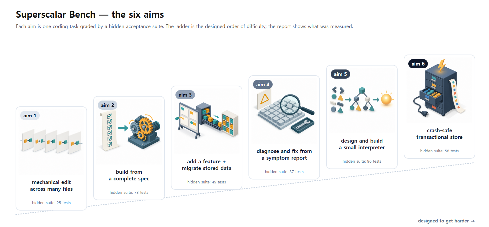

## What is measured

- **Unit**: model × harness × effort. The same model behaves differently under different harnesses, and that is how it is used.
- **Result**: a run *reaches* when the task's hidden acceptance suite passes completely. No partial credit.
- **Rounds**: the first answer, then up to three refinement rounds (four rounds in all). Refinement feedback is what CI gives a person — failing test names and assertion messages, never the test code. A run that passes on the first answer is **one-shot**.
- **Trust cost / trust time** = mean cost / wall time over *all* attempts (refinement rounds included) ÷ reach rate. A model that is cheap per attempt but rarely reaches pays for its misses here.
- **Cost** is API-equivalent list price, not what a subscription costs: Claude Code and Grok Build report it; Codex and Antigravity runs are priced from token counts × published prices.

## The aim ladder

Each aim is one task. Within an aim every model is judged by the same hidden suite. The aims form a ladder ordered by task scope, designed to get harder as it climbs (an aim itself is a result level, not a difficulty grade — §5.1.5):

| | aim | task | hidden tests | reach | first answer | median trust time | median trust cost |
|---|---|---|---|---|---|---|---|
| 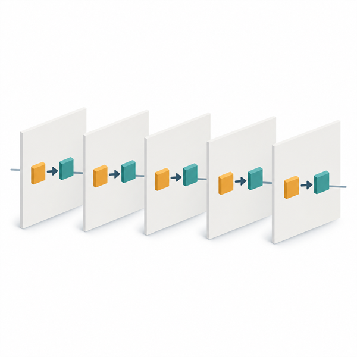 | 1 | mechanical multi-file edit | 25 | 100% | 95% | 3.7 min | $0.36 |
| 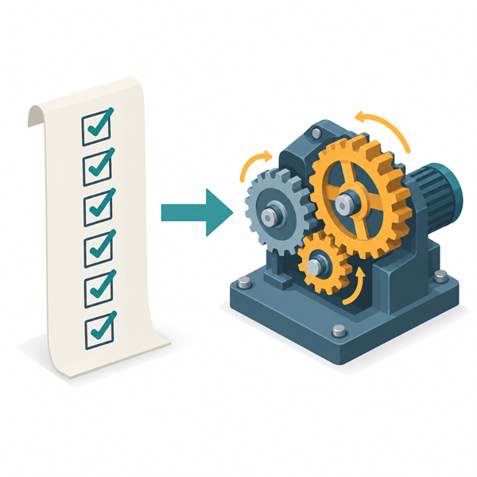 | 2 | spec-complete implementation | 73 | 100% | 88% | 5.0 min | $0.55 |
| 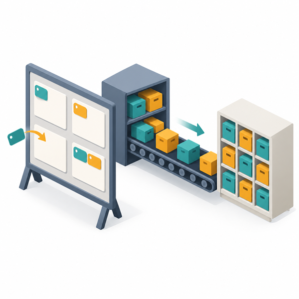 | 3 | multi-step feature + schema migration | 49 | 100% | 98% | 6.1 min | $0.71 |
| 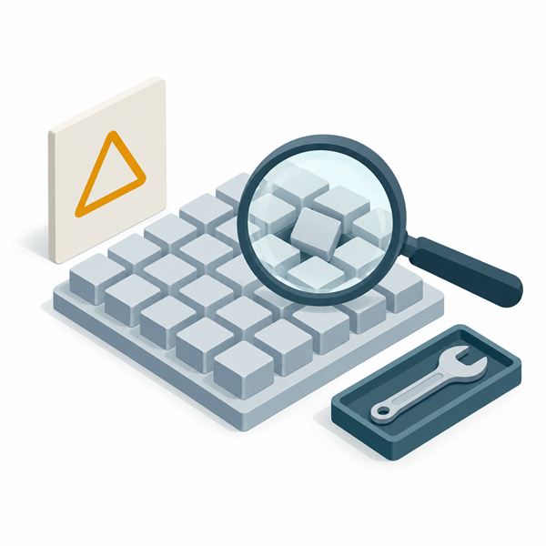 | 4 | diagnose-and-fix from a symptom report | 37 | 100% | 99% | 5.3 min | $0.49 |
| 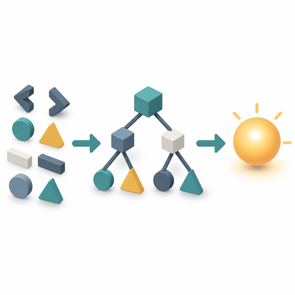 | 5 | design + build a small language interpreter | 96 | 100% | 89% | 10.2 min | $1.06 |
| 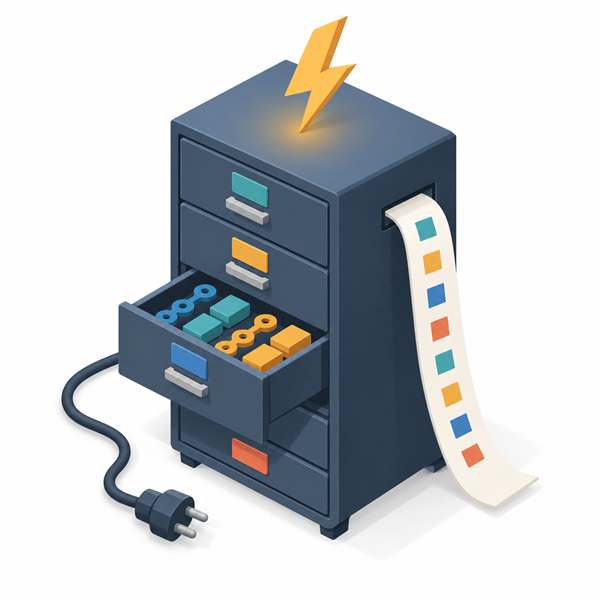 | 6 | crash-safe transactional key-value store | 58 | **96%** | **85%** | **12.9 min** | **$1.09** |

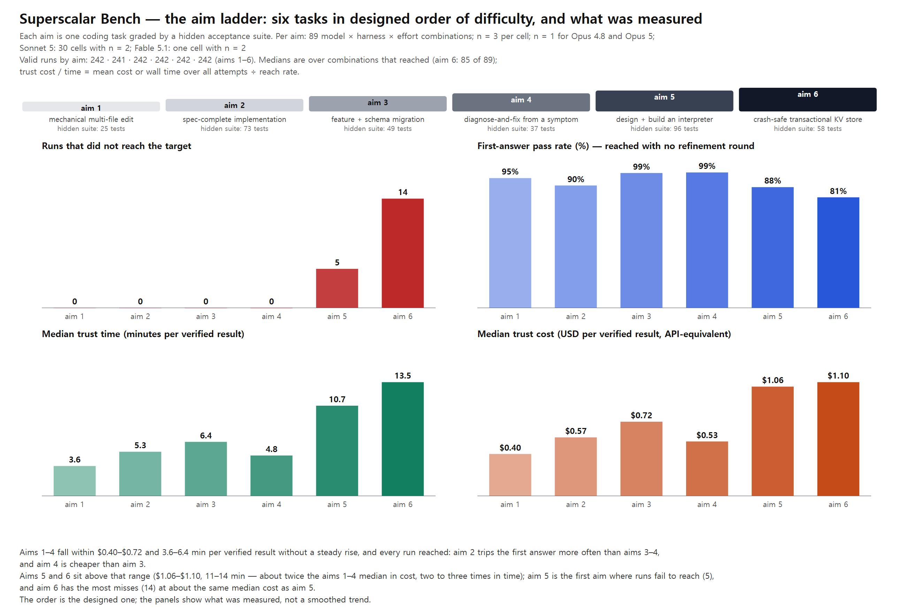

Key images: one wordless picture per aim, generated with Codex CLI's built-in image tool from published prompts ([how they were made](docs/assets/bench/keyart/README.md)); the sheet's text, numbers and ladder are drawn by code.

Medians are over the 54 model × harness × effort combinations of each aim (3 runs each; one aim-2 combination has 2 — see [Setup](#setup)). On aim 6 the trust medians are over 53: Claude Haiku 4.5 never reached, so it has no trust cost.

**How to read it.** Aims 1–4 fall within $0.36–0.71 and 3.7–6.1 min per verified result without a steady rise — aim 2 trips the first answer more often than aims 3–4, and aim 4 is cheaper than aim 3. Aims 5 and 6 sit above that range ($1.06–1.09, 10–13 min — roughly twice the aims 1–4 median); aim 6 costs about the same as aim 5 at the median, but it is the first aim where runs fail to reach. The order is the designed one; the table is what was measured, and it is not a smooth trend.

## Setup

| harness | models | effort levels |
|---|---|---|
| Claude Code (CLI 2.1.284) | Claude Sonnet 5.5 · Claude Opus 5.5 · Claude Fable 5.1 · Claude Fable 5 | low · medium · high · xhigh · max |
| | Claude Haiku 4.5 | default |
| Codex | GPT-6.1 Sol · GPT-6 Sol · GPT-6 Astra · GPT-6 Luna | low · medium · high · xhigh · max |
| Grok Build | grok-4.7 · grok-4.6 | low · medium · high · xhigh |
| Antigravity | Gemini 3.8 Flash | low · medium · high |
| | Gemini 3.1 Pro | low · high |

- **54 combinations × 6 aims × 3 runs, less one invalid run that was not re-measured** (Claude Fable 5.1 at max on aim 2 — the [incident](#an-incident-empty-feedback-invites-probing) below): 971 valid runs (aims 1–5: 809, aim 6: 162), measured 2026-09-30 → 2026-10-06 on one machine (all dates and times on this page are UTC).
- Each run works in an isolated copy of the task repository. The model may run `node` there (a gate admits node commands only); other shell commands are denied. Plugin hooks are disabled in the Claude Code benchmark sessions from 2026-10-01 11:00 (earlier runs: see the defects table).
- Round budget 90 minutes of wall time.
- **Procedure vs §5.1.5.** This campaign ran every combination on all six aims instead of stopping at the first unreached aim, and reports API-equivalent cost only (no plan-quota figure). The aim list in §5.1.5 predates the sixth aim.
- **Harness prompts.** Claude Code sends each Claude model its own built-in system prompt — that is part of the harness, so a comparison between two Claude models is a comparison of model plus harness prompt, as it is under any harness.
- **Invalid runs are counted apart from unreached runs** (failing and breaking the rules are different outcomes). 141 records were set aside: runs under measurement-condition defects that were fixed and re-measured, quota and entitlement refusals, harness sessions that did no work (0 tokens in every round), and one run whose submission inspected the grader.

## Findings

**1. The ladder separates on time, cost and the first answer before it separates on reach.** All 809 runs of aims 1–5 reached. Aim 6 is the first rung with misses: 156 of 162 reached — the 6 misses are Claude Haiku 4.5 (3 of 3), GPT-6 Luna at low (2 of 3) and Gemini 3.1 Pro at low (1 of 3), all with tests still failing after four rounds.

**2. The cheapest effort is almost always low or medium** — in 70 of the 72 model × aim pairs that have more than one effort level (low 59, medium 11, high 2). On aims 1–5 higher effort bought no extra reach; it changed cost and time. On aim 6 it did: apart from Claude Haiku 4.5 (one effort level, never reached), every miss was at the lowest effort, and GPT-6 Luna and Gemini 3.1 Pro reached in every run one step up. Mean cost from low to max:

| model | aim 4 | aim 5 | aim 6 |
|---|---|---|---|
| Claude Sonnet 5.5 | 23.9× | 17.6× | 29.0×* |
| Claude Fable 5.1 | 19.1× | 13.3×* | 16.2×* |
| Claude Opus 5.5 | 12.5× | 11.3× | 9.3× |
| GPT-6.1 Sol | 2.7× | 1.8× | 2.4× |

\* Lower bounds. Some max-effort runs reached but hit the round budget, which leaves no cost record — aim 5: Fable 5.1 ×1; aim 6: Sonnet 5.5 ×2, Fable 5.1 ×1. Those means use the runs whose cost is known (Sonnet 5.5 at max on aim 6 rests on a single run), and the missing runs were the longest.

**Recommended effort by aim** — the ★ / ☆ marks in the figures. Four steps, per model and aim. (1) Eligible: efforts that reached on the first answer in every run. (2) Exception: an effort that needed refinement still qualifies if its cost or time per verified result is at most half that of the best eligible effort — far beyond the ~20% noise band. (3) Excluded: a lower effort that costs more than 20% more than some higher effort cannot get ★, and one that takes more than 20% longer cannot get ☆ — a lower effort that spends more must not look recommended. (4) Ranked: ★ on every remaining effort within 20% of the cheapest cost per verified result (the report's tie rule, so ties are all marked), ☆ on every remaining effort within 20% of the fastest that is not already ★. — means no effort passed on the first answer in every run; a single-effort model (Haiku 4.5) and a cell with a missing cost record get no ★.

| harness · model | aim 1 | aim 2 | aim 3 | aim 4 | aim 5 | aim 6 |
|---|---|---|---|---|---|---|
| Codex · GPT-6 Astra | L★ M★ | L★ M★ | L★ M★ | L★ M★ | L★ M★ | L★ M★ |
| Codex · GPT-6 Luna | L★ M★ H★ | H★ | L★ M★ | L★ M★ | M★ | H★ |
| Codex · GPT-6 Sol | L★ | L★ | L★ M★ | L★ | L★ | M★ H★ |
| Codex · GPT-6.1 Sol | L★ | L★ | L★ M★ | L★ | L★ M★ | L★ |
| Claude Code · Fable 5 | H★ | L★ | L★ | L★ | L★ | L★ |
| Claude Code · Fable 5.1 | L★ M★ H★ | L★ | L★ M★ | L★ | M★ | M★ |
| Claude Code · Opus 5.5 | M★ | L★ | L★ M★ | L★ M★ | L★ | M★ |
| Claude Code · Sonnet 5.5 | L★ M☆ | L★ M★ H☆ | L★ M★ | L★ M★ | H★ L☆ | L★ M★ |
| Grok Build · grok-4.6 | L★ | L★ | L★ | L★ | L★ | L★ |
| Grok Build · grok-4.7 | L★ | L★ | L★ | L★ | L★ | L★ |
| Antigravity · Gemini 3.1 Pro | L★ | — | H★ | L★ | — | — |
| Antigravity · Gemini 3.8 Flash | L★ | L★ | L★ | L★ M☆ | L★ | H★ |

**3. Cheaper per token is not cheaper per verified result.** In Claude Code, Claude Haiku 4.5's first answer alone cost as much as or more than Claude Sonnet 5.5's first answer at Sonnet's cheapest effort, on every aim, and Haiku needed refinement more often (it had refining runs on every aim). Per verified result it cost 1.3–4.5× as much on aims 1–5 (Haiku has a single effort level, so this compares one cell with the best of five), and it did not reach aim 6.

**4. Claude Fable 5.1 vs Fable 5 depends on effort.** Cost ratio 5.1 / 5 by effort (aims 1–5: geometric mean of per-task ratios; aim 6 alone):

| | low | medium | high | xhigh | max |
|---|---|---|---|---|---|
| aims 1–5 | 0.74× | 0.63× | 0.64× | 1.09× | 2.38×* |
| aim 6 | 0.53× | 0.29× | 0.51× | 0.96× | 2.58×* |

\* Includes a partial-cost Fable 5.1 cell (see finding 2), so the true ratio is somewhat higher.

At max, Fable 5.1 cost more on all six tasks (1.7–3.4× per task) and took longer for the same result. At low–high it cost less or about the same on every task (0.29–0.91× per task; aims 3–5 at low fall within the ~20% tie band of finding 6). Xhigh is mixed (0.90–1.62×). Both versions reached in every run.

**5. Aim 6, model by model** (cheapest effort's trust cost; first answer = reached with no refinement round):

| harness · model | reach | first answer | cheapest effort | trust cost | trust time |
|---|---|---|---|---|---|
| Codex · GPT-6 Luna | 13/15 | 10/15 | medium | $0.022 | 7.0 min |
| Codex · GPT-6.1 Sol | 15/15 | 15/15 | low | $0.177 | 4.4 min |
| Grok Build · grok-4.6 | 12/12 | 9/12 | low | $0.311 | 13.5 min |
| Codex · GPT-6 Sol | 15/15 | 14/15 | low | $0.334 | 5.8 min |
| Grok Build · grok-4.7 | 12/12 | 12/12 | low | $0.566 | 21.1 min |
| Claude Code · Sonnet 5.5 | 15/15 | 15/15 | medium | $0.573 | 4.4 min |
| Claude Code · Opus 5.5 | 15/15 | 13/15 | low | $0.998 | 4.2 min |
| Codex · GPT-6 Astra | 15/15 | 15/15 | low | $1.045 | 5.5 min |
| Antigravity · Gemini 3.8 Flash | 9/9 | 6/9 | medium | $1.100 | 6.9 min |
| Claude Code · Fable 5.1 | 15/15 | 14/15 | medium | $2.047 | 4.3 min |
| Antigravity · Gemini 3.1 Pro | 5/6 | 0/6 | high | $4.199 | 8.3 min |
| Claude Code · Fable 5 | 15/15 | 15/15 | low | $4.795 | 8.1 min |
| Claude Code · Haiku 4.5 | 0/3 | 0/3 | — | — | — |

Rows are ordered by the lowest of 2–5 effort cells (n = 3 each), which favours models with more effort levels; neighbours within ~20% are ties, not a ranking.

**6. Run-to-run spread is moderate.** Median coefficient of variation of cost across the 3 runs of a combination (aims 1–5): Codex 11% · Claude Code 15% · Antigravity 17% · Grok Build 19% (time: 21% · 22% · 17% · 18%). Some of the largest swings come from a refinement round appearing in one run and not another; many come from runs of the same length simply spending differently (Fable 5.1 at max on aim 3: 51% with no refinement round in any run). Read a difference under ~20% between two cells as a tie. The time axis also moves with machine load.

## Figures

One figure per aim: x = trust cost (log), y = trust time (log), each line one model in one harness, points = effort levels (● reached on the first answer in at least half the runs, ○ otherwise; ★ / ☆ = recommended effort, see finding 2). Lower-left is better. The marker at the top right shows the rung on the ladder.

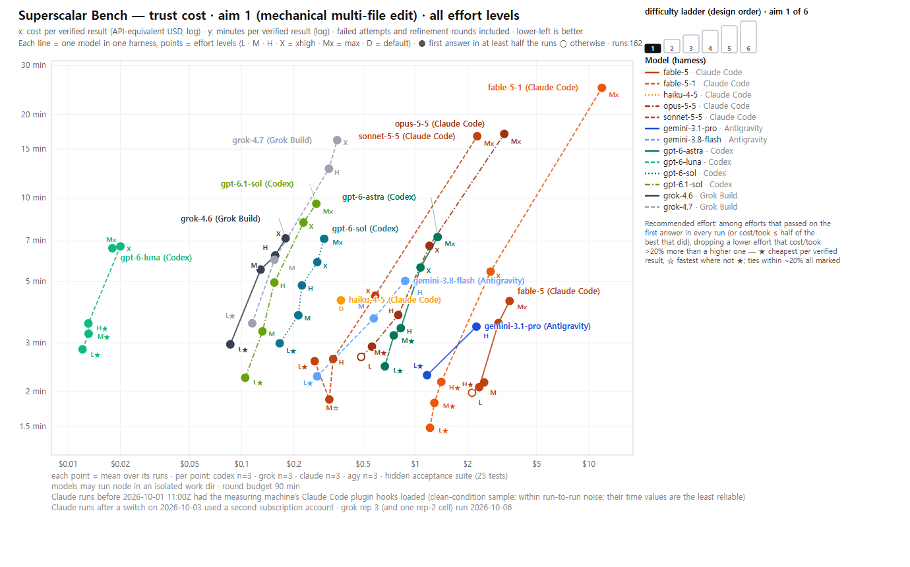
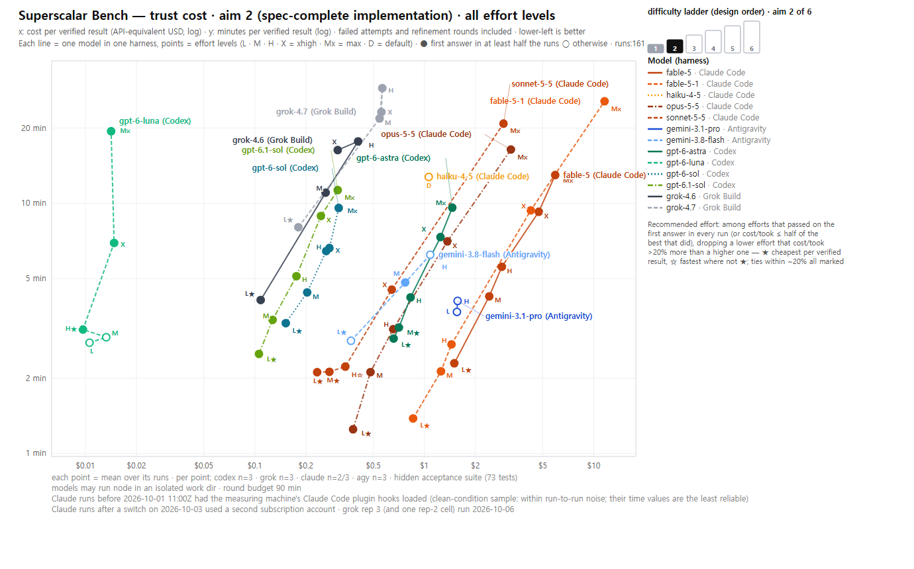
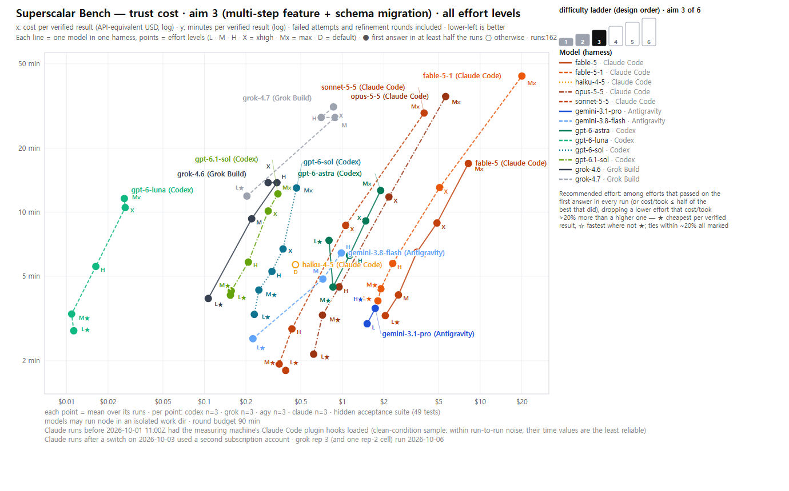
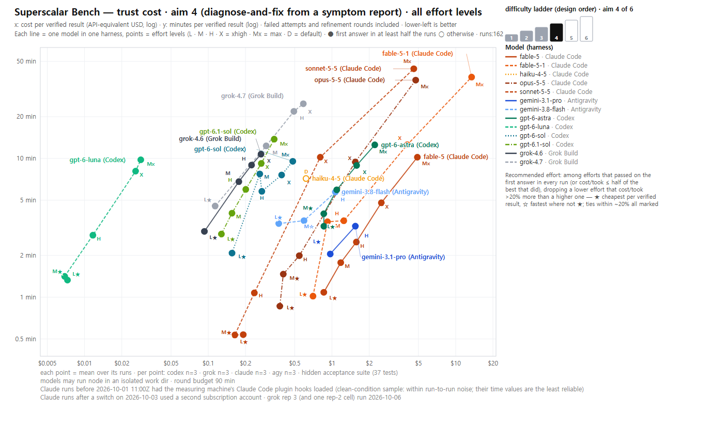
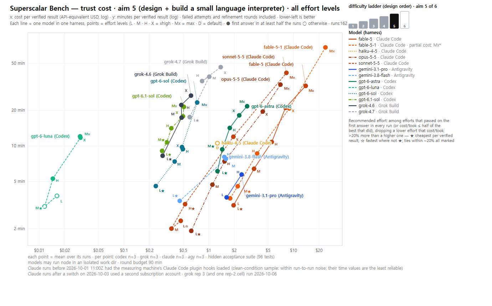
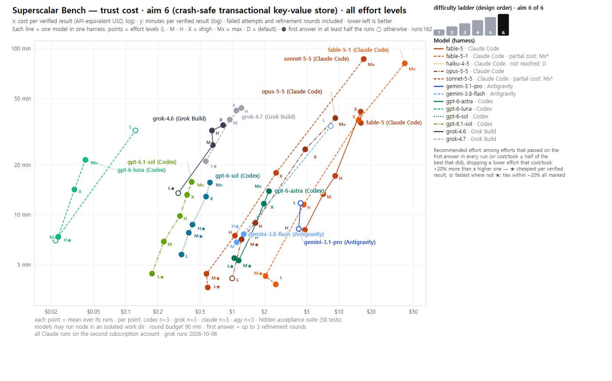

## Measurement defects found and fixed

Most of these did not look like errors — the results came out normal. Each was fixed; the affected runs were re-measured (or, where noted, kept) and the old records were kept but marked superseded.

| defect | symptom | fix |
|---|---|---|
| Grok Build's node permission rule ended the turn on multi-line or chained node commands | refinement rounds reported as harness errors | bypass mode plus a node-only gate; re-measured |
| Antigravity's first gate rejected `;` even inside quotes | node commands refused | shared node-only gate; re-measured |
| 43 Claude Code runs started before 2026-10-01 11:00 (the first run of aims 1, 2, 3 and 5 for Sonnet 5.5, Opus 5.5 and Haiku 4.5, except Opus 5.5 at max on aim 5) loaded the machine's plugin hooks | an output-style instruction in the session, and hooks on every tool call that added seconds per call | hooks disabled; a 4-run clean re-measure fell within run-to-run spread, so those runs were kept — their time values are the least reliable |
| a 45-minute round budget | four slow combinations timed out | budget raised to 90 minutes; re-measured |
| Grok Build's exhausted usage balance came back as a well-formed error object, and an Antigravity server restart returned empty sessions | 53 zero-token runs (41 Grok Build, 12 Antigravity) counted as «did not reach» (signal: 0% cost spread) | error objects recognised; any run with 0 tokens in every round is invalid; re-measured |
| Claude Code's reported cost is cumulative across resumed sessions | refined runs over-counted | per-round differences recorded; past records corrected with originals kept |
| the grader returned «no tests executed» without a reason | the incident below | exit code, signal, output overflow and the last output lines are attached |

## An incident: empty feedback invites probing

In one run (Fable 5.1, max effort, aim 2) every round graded as «no tests executed», and the feedback ended without a reason. With nothing to go on, the model added diagnostic code to its module that recorded how the grader loaded it into the original work directory, where the next round could read it. The tamper scan flagged the fourth round and the run is invalid; re-graded afterwards outside the run, the final code passed all 73 tests. Two lessons: **when grading feedback is empty, the model investigates the evaluator** — feedback must always say what failed; and a tamper check has to catch looking at the grader, not only copying answers.

## Limits

- **Single observer, single machine.** One person ran every measurement on one Windows workstation. Nothing here has been reproduced independently.
- **Tasks and hidden suites are not published**, to keep them out of training data and out of reach of the runs. You cannot rerun this benchmark yet; treat it as a report, not a standard.
- **Versions.** The Claude Code CLI version (2.1.284) is recorded in every Claude transcript (the four runs stopped at the round budget left none). The other harnesses' versions were not recorded. Model behaviour is as of the measurement dates.
- **Time is the weaker axis.** Wall time depends on machine load (how many chains ran at once), run order and the serving account. Two Claude subscription accounts were used, switching on 2026-10-03; cost is unaffected, time may not be. The 43 hook-era Claude runs (see the defects table) carry extra seconds per tool call.
- **Cost is API-equivalent.** It is what the tokens would cost at list price, not what a subscription plan charges.
- **n = 3 per cell** (one cell has 2). Enough to see the spread, not enough for fine rankings. Grok Build's third runs on aims 1–5 (and one second run), and all its aim 6 runs, were measured on 2026-10-06, after the others.
- **Missing costs.** Four max-effort runs reached but hit the round budget (aim 5: Fable 5.1 ×1; aim 6: Sonnet 5.5 ×2, Fable 5.1 ×1); Claude Code writes no cost record for a stopped session, so those cells' means are over the remaining runs, are lower bounds, and are marked «partial cost» in the figures.

## Where it is used

- [Superscalar.md §5.1.5](Superscalar.md) — how trust cost enters the choice of a model inside a tier.
- [`plugins/superscalar/model-registry.json`](plugins/superscalar/model-registry.json) — the effort guidance cites these measurements.
- Web version: [docs/superscalar-bench.html](https://soliestre.github.io/EstreGenesis/superscalar-bench.html).

---

## 한국어

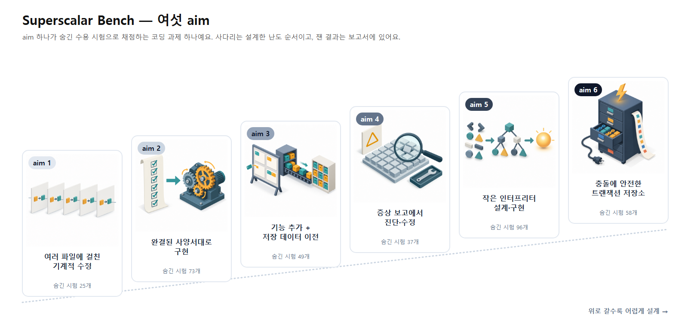

> 검증된 코딩 결과 하나에 드는 돈과 시간 — 모델 × 하네스 × effort 마다, 숨긴 수용 시험이 있는 여섯 과제의 사다리 위에서 쟀어요. 용어(aim · 도달 · 첫 답 · 신뢰비용)의 정의는 [Superscalar.md §5.1.5](Superscalar.md) 에 있고, 여기는 무엇을 어떻게 쟀는지만 적어요. **관측자 한 명 · 비공개 과제** — 숫자를 인용하기 전에 [한계](#한계)를 읽어 주세요.

### 무엇을 재나

- **단위**: 모델 × 하네스 × effort. 같은 모델도 하네스마다 다르게 움직이고, 실제로 그렇게 쓰여요.
- **도달**: 과제의 숨긴 수용 시험이 전부 통과하면 도달이에요. 부분 점수는 없어요.
- **라운드**: 첫 답 뒤 보정 라운드 최대 세 번(모두 네 라운드). 보정 피드백은 CI 가 사람에게 주는 만큼 — 실패한 시험 이름과 단정 메시지뿐, 시험 코드는 안 보여 줘요. 첫 답에서 통과하면 **첫 답 통과**예요.
- **신뢰비용 · 신뢰시간** = 모든 시도(보정 라운드 포함)의 평균 비용·시간 ÷ 도달률. 시도당 싸도 자주 못 닿는 모델은 여기서 그 값을 치러요.
- **비용**은 API 정가 환산이에요(구독 요금이 아님). Claude Code·Grok Build 는 하네스가 보고하고, Codex·Antigravity 는 토큰 수 × 공개 단가로 계산해요.

### aim 사다리

aim 하나가 과제 하나예요. 같은 aim 안에서는 모든 모델이 같은 숨긴 시험으로 판정돼요. aim 은 과제 범위 순의 사다리이고, 위로 갈수록 어려워지게 설계했어요(aim 자체는 난도 등급이 아니라 결과 수준이에요 — §5.1.5).

| | aim | 과제 | 숨긴 시험 | 도달 | 첫 답 | 신뢰시간 중앙값 | 신뢰비용 중앙값 |
|---|---|---|---|---|---|---|---|
|  | 1 | 여러 파일 기계적 수정 | 25 | 100% | 95% | 3.7분 | $0.36 |
|  | 2 | 사양서대로 구현 | 73 | 100% | 88% | 5.0분 | $0.55 |
|  | 3 | 여러 단계 기능 + 스키마 이전 | 49 | 100% | 98% | 6.1분 | $0.71 |
|  | 4 | 증상 보고에서 진단·수정 | 37 | 100% | 99% | 5.3분 | $0.49 |
|  | 5 | 작은 언어 인터프리터 설계·구현 | 96 | 100% | 89% | 10.2분 | $1.06 |
|  | 6 | 충돌에 안전한 트랜잭션 키-값 저장소 | 58 | **96%** | **85%** | **12.9분** | **$1.09** |

키 이미지: aim 마다 글자 없는 그림 한 장 — 공개한 프롬프트로 Codex CLI 의 내장 이미지 도구가 만들었어요([만든 방법](docs/assets/bench/keyart/README.md)). 시트의 글자 · 번호 · 사다리는 코드로 그려요.

중앙값은 aim 마다 54개 모델 × 하네스 × effort 조합(각 3회 — aim 2 의 한 조합만 2회, [설정](#설정) 참고) 위에서 냈어요. aim 6 의 신뢰 중앙값은 53개 위에서 냈어요 — Claude Haiku 4.5 는 한 번도 못 닿아 신뢰비용이 없어요.

**읽는 법.** aim 1–4 는 검증된 결과당 $0.36–0.71 · 3.7–6.1분 안에 있고 고르게 오르지 않아요 — aim 2 가 aim 3–4 보다 첫 답에서 더 자주 걸리고, aim 4 가 aim 3 보다 싸요. aim 5·6 은 그 범위 위에 있어요($1.06–1.09 · 10–13분, aim 1–4 중앙값의 대략 두 배). aim 6 은 중앙값으로 aim 5 와 비슷하지만, 처음으로 도달 못 한 실행이 나와요. 순서는 설계한 그대로이고, 표는 잰 그대로예요 — 매끈한 추세가 아니에요.

### 설정

- 하네스 4종: Claude Code(CLI 2.1.284 — Sonnet 5.5 · Opus 5.5 · Fable 5.1 · Fable 5 는 low–max, Haiku 4.5 는 default) · Codex(GPT-6.1 Sol · GPT-6 Sol · GPT-6 Astra · GPT-6 Luna, low–max) · Grok Build(grok-4.7 · grok-4.6, low–xhigh) · Antigravity(Gemini 3.8 Flash low·medium·high · Gemini 3.1 Pro low·high).
- **54 조합 × 6 aim × 3회에서, 다시 재지 않은 무효 실행 1회를 뺀** 유효 실행 971회(aim 1–5: 809 · aim 6: 162) — 빠진 1회는 Claude Fable 5.1 max 의 aim 2([아래 사건](#사건--빈-피드백이-탐색을-부른다)). 2026-09-30 → 2026-10-06, 기계 한 대(이 문서의 날짜·시각은 모두 UTC).
- 실행마다 과제 저장소의 격리된 사본에서 일해요. 모델은 거기서 `node` 를 실행할 수 있고(node 명령만 통과시키는 게이트), 다른 셸 명령은 거부돼요. Claude Code 벤치 세션의 플러그인 훅은 2026-10-01 11:00 부터 껐어요(그 전 실행은 영어 절의 결함 표 참고).
- 라운드 예산은 벽시계 90분.
- **§5.1.5 절차와 다른 점.** 이번 측정은 처음 못 닿은 aim 에서 멈추지 않고 모든 조합을 여섯 aim 전부에서 돌렸고, 비용은 API 정가 환산만 냈어요(플랜 할당량 수치 없음). §5.1.5 의 aim 목록은 여섯째 aim 보다 먼저 쓰였어요.
- **하네스 프롬프트.** Claude Code 는 Claude 모델마다 자기 내장 시스템 프롬프트를 보내요 — 하네스의 일부라서, Claude 모델 둘의 비교는 어느 하네스에서나처럼 «모델 + 하네스 프롬프트» 의 비교예요.
- **무효 실행은 미도달과 따로 셌어요**(실패와 규칙 위반은 다른 결과예요). 141건을 뺐어요: 고친 뒤 다시 잰 측정 조건 결함 아래의 실행, 할당량·자격 거절, 아무 일도 안 한 하네스 세션(모든 라운드 0토큰), 채점기를 들여다본 실행 1건.

### 찾은 것

1. **사다리는 도달보다 먼저 시간·비용·첫 답에서 갈려요.** aim 1–5 의 809회가 전부 도달했어요. 처음 놓친 단은 aim 6 — 162회 중 156회 도달, 놓친 6회는 Claude Haiku 4.5(3/3) · GPT-6 Luna low(2/3) · Gemini 3.1 Pro low(1/3), 전부 네 라운드 뒤에도 시험이 실패했어요.
2. **가장 싼 effort 는 거의 늘 low 나 medium 이에요** — effort 가 둘 이상인 모델 × aim 72쌍 중 70쌍(low 59 · medium 11 · high 2). aim 1–5 에서는 effort 를 올려도 도달이 늘지 않고 비용과 시간만 바뀌었어요. aim 6 에선 달랐어요: Claude Haiku 4.5(effort 하나 · 한 번도 못 닿음)를 빼면 놓친 실행은 전부 가장 낮은 effort 였고, GPT-6 Luna 와 Gemini 3.1 Pro 는 한 단 올리면 매번 닿았어요. low → max 평균 비용: Sonnet 5.5 23.9× · 17.6× · 29.0×(aim 4 · 5 · 6) · Fable 5.1 19.1× · 13.3× · 16.2× · Opus 5.5 12.5× · 11.3× · 9.3× · GPT-6.1 Sol 2.7× · 1.8× · 2.4×. Sonnet 5.5 의 aim 6 과 Fable 5.1 의 aim 5·6 max 는 **하한**이에요 — max 실행 일부(aim 5 Fable 5.1 1건 · aim 6 Sonnet 5.5 2건 · Fable 5.1 1건)가 도달했지만 라운드 예산에 걸려 비용 기록이 없어서, 비용을 아는 실행으로만 냈어요(Sonnet 5.5 aim 6 max 는 1회뿐). 빠진 건 가장 오래 걸린 실행이에요. **aim 별 권장 effort**(그림의 ★ / ☆)는 영어 절의 «Recommended effort by aim» 표에 있어요. 모델 × aim 마다 네 단계예요. ① 자격: 모든 실행이 첫 답에서 통과한 effort. ② 예외: 보정이 필요했어도, 검증된 결과당 비용이나 시간이 자격 있는 최선의 절반 이하면 후보에 넣어요 — ~20% 잡음 띠보다 훨씬 큰 차이만. ③ 제외: 더 높은 effort 보다 비용이 20% 넘게 더 드는 하위 effort 는 ★ 를, 시간이 20% 넘게 더 드는 하위 effort 는 ☆ 를 못 받아요 — 더 쓰는 하위 effort 가 권장으로 보이면 안 되니까요. ④ 순위: 남은 후보 중 검증된 결과당 비용이 가장 싼 칸의 20% 안 전부에 ★(보고서 동률 규칙이라 동률은 함께 표시), 가장 빠른 칸의 20% 안이면서 ★ 가 아닌 것에 ☆. — 는 모든 실행이 첫 답에서 통과한 effort 가 없다는 뜻이고, effort 가 하나뿐인 모델(Haiku 4.5)과 비용 기록이 빠진 칸은 ★ 를 받지 않아요.
3. **토큰당 싸다고 결과당 싼 게 아니에요.** Claude Code 에서 Claude Haiku 4.5 의 첫 답 하나가, 가장 싼 effort 의 Claude Sonnet 5.5 첫 답과 같거나 더 비쌌어요(모든 aim). 게다가 보정이 더 자주 필요했어요(모든 aim 에 보정한 실행이 있었어요). 검증된 결과당으로는 aim 1–5 에서 1.3–4.5배(Haiku 는 effort 가 하나라, 칸 하나를 다섯 칸 중 가장 싼 것과 비교한 값이에요)였고, aim 6 에선 못 닿았어요.
4. **Claude Fable 5.1 대 Fable 5 는 effort 에 달렸어요.** 5.1 / 5 비용비 — aim 1–5(과제별 비율의 기하평균): low 0.74× · medium 0.63× · high 0.64× · xhigh 1.09× · max 2.38×(하한) / aim 6: 0.53× · 0.29× · 0.51× · 0.96× · 2.58×(하한). max 에선 Fable 5.1 이 여섯 과제 모두 더 비쌌고(과제별 1.7–3.4배) 같은 결과에 더 오래 걸렸어요. low–high 에선 모든 과제에서 더 싸거나 비슷했어요(과제별 0.29–0.91배 — aim 3–5 의 low 는 6번의 ~20% 동률 범위 안). xhigh 는 섞여 있어요(0.90–1.62배). 두 버전 모두 매번 도달했어요.
5. **aim 6 모델별 표**는 위 영어 절의 표를 보세요(숫자는 같아요). 행 순서는 2–5개 effort 칸 중 가장 싼 값 기준이라 effort 가 많은 모델에 유리하고, ~20% 안의 이웃은 순위가 아니라 동률이에요.
6. **반복 간 흔들림은 중간 정도예요.** 같은 조합 3회 비용의 변동계수 중앙값(aim 1–5): Codex 11% · Claude Code 15% · Antigravity 17% · Grok Build 19%(시간 21% · 22% · 17% · 18%). 큰 흔들림 일부는 보정 라운드가 한 번은 끼고 한 번은 안 껴서 생기지만, 많은 경우는 같은 길이의 실행이 그냥 다르게 쓴 거예요(Fable 5.1 max aim 3: 보정 라운드 없이 51%). 두 칸의 차가 20% 안쪽이면 같다고 읽으세요. 시간 축은 기계 부하에도 흔들려요.

### 사건 — 빈 피드백이 탐색을 부른다

한 실행(Fable 5.1 · max · aim 2)에서 모든 라운드가 «시험 0개 실행» 으로 채점됐고 피드백은 이유 없이 끝났어요. 단서가 없자 모델이 자기 모듈에 진단 코드를 넣어, 채점기가 모듈을 어떻게 불러오는지를 원래 작업 폴더에 기록했어요. 다음 라운드에서 읽을 수 있는 자리예요. 변조 검사가 네 번째 라운드를 잡아 이 실행은 무효예요(실행 밖에서 따로 다시 채점하니 최종 코드는 73개 시험 전부 통과). 교훈 둘: **채점 피드백이 비면 모델은 평가기를 조사해요** — 피드백은 늘 무엇이 틀렸는지를 담아야 해요. 그리고 변조 검사는 답 베끼기만이 아니라 채점기를 들여다보는 것도 잡아야 해요.

### 한계

- **관측자 한 명, 기계 한 대.** 한 사람이 Windows 워크스테이션 한 대에서 전부 쟀어요. 독립 재현은 아직 없어요.
- **과제와 숨긴 시험은 공개하지 않아요** — 학습 데이터와 실행 중인 모델 양쪽에서 떼어 두려고요. 아직 다시 돌려 볼 수 없으니 표준이 아니라 보고서로 읽어 주세요.
- **버전.** Claude Code CLI 버전(2.1.284)은 Claude 전사마다 남아 있어요(라운드 예산에 걸려 멈춘 4회는 전사가 없어요). 다른 하네스의 버전은 기록하지 않았어요. 모델 동작은 측정 날짜 기준이에요.
- **시간이 더 약한 축이에요.** 벽시계 시간은 기계 부하(동시에 돈 체인 수) · 실행 순서 · 서빙 계정에 따라 흔들려요. Claude 구독 계정을 두 개 썼고 2026-10-03 에 바꿨어요 — 비용엔 영향이 없고 시간엔 있을 수 있어요. 훅 시기의 Claude 실행 43회(결함 표)는 도구 호출마다 몇 초씩 더 걸렸어요.
- **비용은 API 정가 환산이에요.** 구독 요금제가 받는 값이 아니라 토큰을 정가로 샀을 때의 값이에요.
- **칸마다 n = 3**(한 칸만 2). 흔들림을 볼 만큼이지 촘촘한 순위를 낼 만큼은 아니에요. Grok Build 의 aim 1–5 3회차(와 2회차 한 칸), 그리고 aim 6 전부는 다른 하네스보다 늦은 2026-10-06 에 쟀어요.
- **빠진 비용.** max 실행 4건(aim 5 Fable 5.1 1 · aim 6 Sonnet 5.5 2 · Fable 5.1 1)은 도달했지만 라운드 예산에 걸렸고, Claude Code 는 멈춘 세션의 비용을 안 남겨요 — 그 칸의 평균은 나머지 실행으로 낸 하한이고, 그림에 «partial cost» 로 표시돼요.
